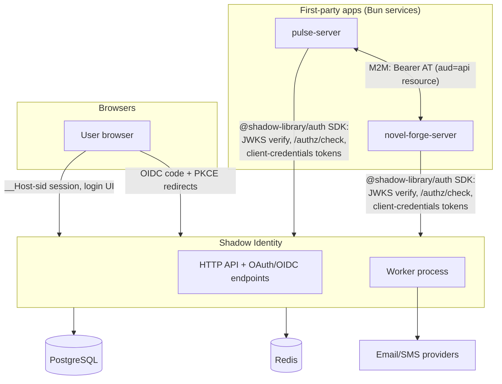
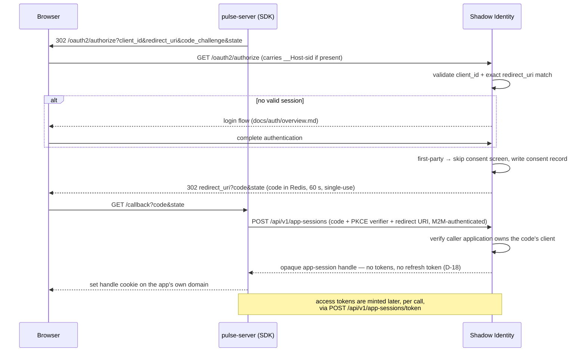
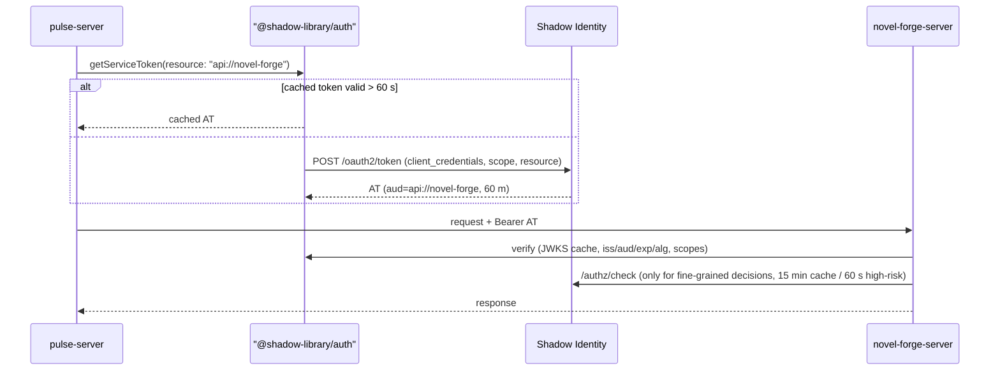
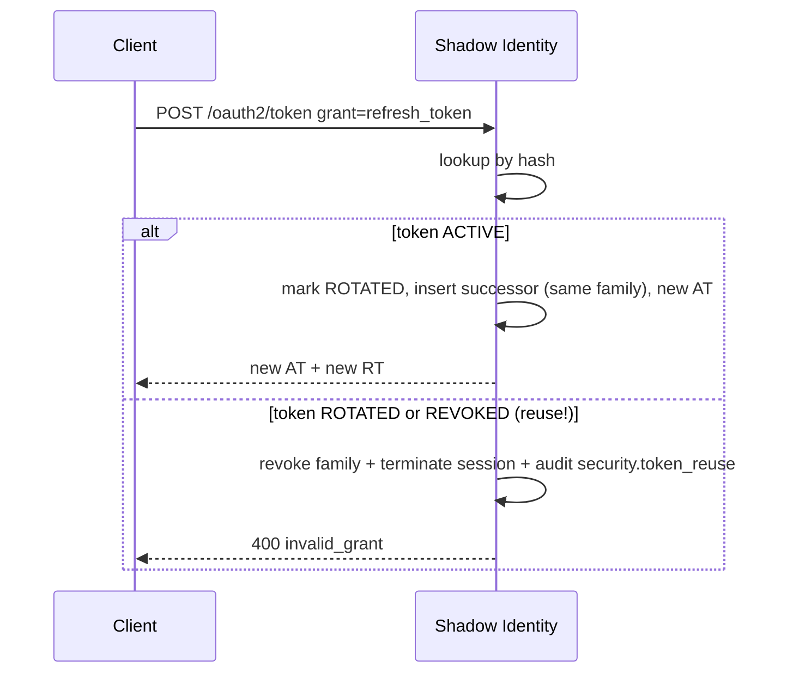
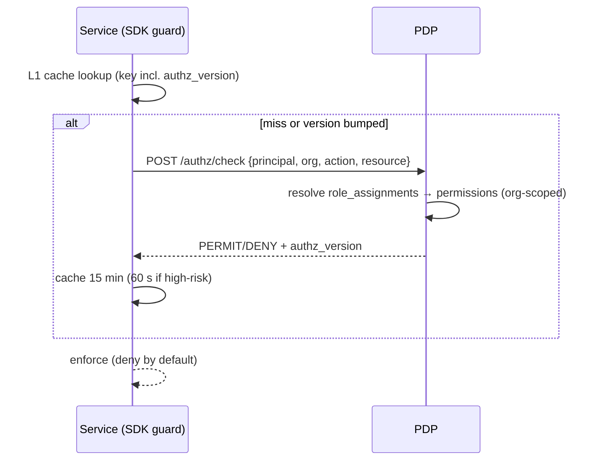
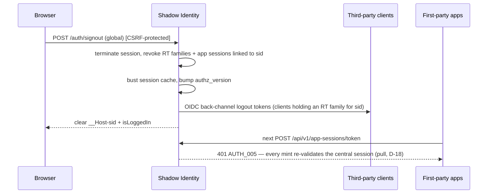

# Shadow Identity — Target Architecture Specification

|                  |                                                                                                                                                |
| :--------------- | :--------------------------------------------------------------------------------------------------------------------------------------------- |
| **Status**       | Approved for development                                                                                                                       |
| **Version**      | 1.1.0                                                                                                                                          |
| **Last updated** | 2026-07-25                                                                                                                                     |
| **Supersedes**   | The SSO and token-rotation designs previously described in `docs/auth/overview.md` (§E and conditional rotation in §D of the pre-1.0 revision) |

The key words **MUST**, **MUST NOT**, **SHOULD**, **SHOULD NOT**, and **MAY** are to be interpreted as described in RFC 2119.

## Document map

| Document                                    | Contents                                                                             |
| :------------------------------------------ | :----------------------------------------------------------------------------------- |
| `docs/architecture.md` (this document)      | Target architecture, decisions, trust model, token model, module boundaries          |
| `docs/database.md`                          | Target data model: entities, constraints, tenancy rules, lifecycle states, retention |
| `docs/auth/overview.md`                     | Interactive authentication flow specification (registration, login, recovery, MFA)   |
| `docs/auth/api-contract.md`                 | HTTP API contract for the interactive authentication flows                           |
| `docs/sdk.md` (`@shadow-library/auth` repo) | Specification of the SDK for consuming services — moved to the SDK's own repository  |
| `docs/tasks.md`                             | Development backlog: milestones, tasks, detailed change lists, acceptance criteria   |
| `docs/standards.md`                         | Cross-cutting engineering conventions (IDs, error codes, localization)               |

---

## 1. Purpose and scope

Shadow Identity is the centralized identity, authentication, and authorization platform for the Shadow Apps ecosystem. It is the **only** component in the ecosystem that stores credentials, issues tokens, or answers authorization questions.

It acts as:

1. The account system and user directory for all first-party applications.
2. An **OpenID Connect identity provider** and **OAuth 2.1 authorization server** for interactive (human) logins to first-party applications.
3. The **machine-to-machine (M2M) identity provider** for all service-to-service calls inside the ecosystem (client credentials grant).
4. The central **policy decision point (PDP)** for role- and permission-based authorization.
5. The session-management and security control plane (device list, remote logout, sign-in history).

Out of scope for the current phase, but explicitly planned for (see §14): SAML 2.0 IdP, inbound enterprise federation (customer IdPs), SCIM provisioning, verified custom domains, third-party (external developer) OAuth clients, and multi-region data residency.

## 2. Definitions

| Term                   | Meaning                                                                                                   |
| :--------------------- | :-------------------------------------------------------------------------------------------------------- |
| **Principal**          | Any authenticated actor: a user or a service account                                                      |
| **Organisation**       | Tenant boundary. Every principal and every tenant-owned row belongs to exactly one organisation           |
| **Personal workspace** | The synthetic organisation created for every user at registration (Decision D-1)                          |
| **Application**        | A logical product in the ecosystem (e.g. Pulse, Novel Forge). Owns OAuth clients, API resources, roles    |
| **OAuth client**       | A registered credentialed entity that can request tokens: browser app, server app, or service account     |
| **API resource**       | A protected API surface identified by a URI, used as the token `aud`ience                                 |
| **PDP / PEP**          | Policy decision point (identity service) / policy enforcement point (each consuming service, via the SDK) |
| **First-party**        | Built and operated by us; trusted to bypass the consent screen but never the protocol                     |

## 3. Architectural decisions

Decisions are binding. Changing one requires updating this document first.

| ID       | Decision                                                                                                                                                                                                                                                                                                                                                                                                                                                                                                                                                                                                                                                                                                                                                                                     | Rationale / consequences                                                                                                                                                                                                                                                                                                                                                                                                                                                                                                                                                                                                                                                                                                     |
| :------- | :------------------------------------------------------------------------------------------------------------------------------------------------------------------------------------------------------------------------------------------------------------------------------------------------------------------------------------------------------------------------------------------------------------------------------------------------------------------------------------------------------------------------------------------------------------------------------------------------------------------------------------------------------------------------------------------------------------------------------------------------------------------------------------------- | :--------------------------------------------------------------------------------------------------------------------------------------------------------------------------------------------------------------------------------------------------------------------------------------------------------------------------------------------------------------------------------------------------------------------------------------------------------------------------------------------------------------------------------------------------------------------------------------------------------------------------------------------------------------------------------------------------------------------------- |
| **D-1**  | Every user gets a **synthetic personal workspace** (an `organisations` row of type `PERSONAL`) at registration. Every tenant-owned row carries `organisation_id NOT NULL`.                                                                                                                                                                                                                                                                                                                                                                                                                                                                                                                                                                                                                   | One uniform tenancy rule; no nullable-tenant special cases; retrofit-free path to enterprise orgs and to data residency (org is the residency/shard unit).                                                                                                                                                                                                                                                                                                                                                                                                                                                                                                                                                                   |
| **D-2**  | Service-to-service authentication uses **OAuth 2.0 client credentials** with short-lived JWT access tokens issued by this service. Service accounts are OAuth clients (`kind = SERVICE`). No static API keys, no mTLS mesh.                                                                                                                                                                                                                                                                                                                                                                                                                                                                                                                                                                  | One token format and one verification path for human and machine calls; SDK handles acquisition/caching. mTLS rejected: no mesh infrastructure, no threat-model justification yet.                                                                                                                                                                                                                                                                                                                                                                                                                                                                                                                                           |
| **D-3**  | Access tokens carry **identity, tenant, audience, and scopes only — never roles or permissions**. Permissions are resolved at the PDP per request and cached briefly by the SDK.                                                                                                                                                                                                                                                                                                                                                                                                                                                                                                                                                                                                             | Bounded revocation latency (≤ cache TTL); small stable tokens; no stale-authorization class of bugs. Cost: one extra (cached) call per unique decision.                                                                                                                                                                                                                                                                                                                                                                                                                                                                                                                                                                      |
| **D-4**  | First-party clients **bypass the consent screen but never the protocol**: full Authorization Code + PKCE with registered exact-match redirect URIs. The bespoke `/sso/authorize` design is **withdrawn**.                                                                                                                                                                                                                                                                                                                                                                                                                                                                                                                                                                                    | Consent UX without redirect/token-leak vulnerabilities; third-party support later is additive (enable consent screen).                                                                                                                                                                                                                                                                                                                                                                                                                                                                                                                                                                                                       |
| **D-5**  | All authentication and protocol logic is implemented **in this repository**, on top of the `@shadow-library` framework. The framework provides transport, DI, validation, caching, and state machines — it is not and will not become an IdP. The consumer package **`@shadow-library/auth`** (see `docs/sdk.md` in the SDK's repository) gives consuming services verification, guards, and token management; it is maintained in its **own repository** (originally developed here as the workspace package `packages/auth`, extracted so consumers version the SDK independently of the server).                                                                                                                                                                                          | Framework stays generic; auth logic centralized here; consumers never hand-roll auth.                                                                                                                                                                                                                                                                                                                                                                                                                                                                                                                                                                                                                                        |
| **D-6**  | Caching uses `@shadow-library/modules` **`CacheModule`** (L1 in-process LRU + L2 Redis). Memcached is removed. Redis is a **required** dependency.                                                                                                                                                                                                                                                                                                                                                                                                                                                                                                                                                                                                                                           | One cache stack; Redis is already required for flow state, rate limits, and revocation.                                                                                                                                                                                                                                                                                                                                                                                                                                                                                                                                                                                                                                      |
| **D-7**  | Data residency is **deferred but designed for**: UUIDv7 primary keys (no global sequences), `organisation_id` on every tenant row (shard/region key), `region` column on `organisations` and `users` (single value `default` for now), no cross-tenant JOINs outside the directory index, and a minimal global "identifier → user/region" lookup path kept separable from PII.                                                                                                                                                                                                                                                                                                                                                                                                               | When residency is required, tenants move as units; no key-space or query rewrites.                                                                                                                                                                                                                                                                                                                                                                                                                                                                                                                                                                                                                                           |
| **D-8**  | Primary keys are **UUIDv7** (`Bun.randomUUIDv7()`), stored as `uuid`. External representations are prefixed per `docs/standards.md` (`usr_…`, `org_…`, `sess_…`). Bigserial keys are abolished.                                                                                                                                                                                                                                                                                                                                                                                                                                                                                                                                                                                              | Time-ordered (index-friendly), region-portable, non-enumerable externally, consistent with the ID-prefix standard.                                                                                                                                                                                                                                                                                                                                                                                                                                                                                                                                                                                                           |
| **D-9**  | Token signing uses **EdDSA (Ed25519)** with `kid`-addressed keys published via JWKS. Private keys are stored encrypted (AES-256-GCM envelope) under a master key-encryption key; the key provider is an interface so a KMS/HSM can replace env-based KEK without schema changes. Verifiers MUST enforce an algorithm allowlist of exactly `EdDSA`.                                                                                                                                                                                                                                                                                                                                                                                                                                           | Fast, small signatures; native WebCrypto support in Bun; algorithm-confusion attacks precluded by allowlisting. ES256 is the designated fallback if a future third-party integration cannot verify Ed25519.                                                                                                                                                                                                                                                                                                                                                                                                                                                                                                                  |
| **D-10** | Browser authentication to the identity service itself uses an **opaque, server-side session** (`__Host-sid` cookie), not JWT cookies. JWTs exist only as OAuth/OIDC artifacts issued to clients.                                                                                                                                                                                                                                                                                                                                                                                                                                                                                                                                                                                             | Instant revocation for the control plane; CSRF surface bounded; JWT lifetime problems don't apply to the primary session.                                                                                                                                                                                                                                                                                                                                                                                                                                                                                                                                                                                                    |
| **D-11** | Refresh tokens are opaque, stored hashed, and **rotate on every use** with family-based reuse detection: presenting any revoked family member revokes the family and its session. The previously documented conditional rotation is withdrawn. Since D-18, refresh tokens are issued to **third-party clients only** — no first-party consumer exists until third-party enablement (§14).                                                                                                                                                                                                                                                                                                                                                                                                    | Restores the theft-detection property rotation exists for.                                                                                                                                                                                                                                                                                                                                                                                                                                                                                                                                                                                                                                                                   |
| **D-12** | *(Retired 2026-07-26.)* Login is now an **account-state oracle**: `login/init` answers `AUTH_008` for an unknown identifier and `AUTH_009`/`AUTH_010`/`AUTH_011` for a blocked, suspended or deactivated account, so a dead end is named at the identifier step instead of surfacing as a generic failure one step later. Registration and recovery **stay neutral**. | Deliberate trade: enumeration resistance at login was costing every legitimate user a wasted password attempt. Containment is now the Tier-2 `login-init` budget (20/h) rather than response symmetry. Residual risk in §11. |
| **D-13** | Deployment is a **modular monolith** plus a worker process, one PostgreSQL, one Redis. Background jobs use a Postgres-backed queue (`FOR UPDATE SKIP LOCKED`). No message broker until job volume proves the need.                                                                                                                                                                                                                                                                                                                                                                                                                                                                                                                                                                           | Matches team size and scale; the transactional boundary is the tenant-isolation boundary.                                                                                                                                                                                                                                                                                                                                                                                                                                                                                                                                                                                                                                    |
| **D-14** | The repo's local `DatastoreService` is replaced by `@shadow-library/modules` **`DatabaseModule`** (≥ 0.5), which lifecycle-manages Postgres/Redis clients.                                                                                                                                                                                                                                                                                                                                                                                                                                                                                                                                                                                                                                   | Removes duplicated client management and the unsafe local SQL param-interpolating logger.                                                                                                                                                                                                                                                                                                                                                                                                                                                                                                                                                                                                                                    |
| **D-15** | Role/permission **definitions are owned by each application in code** and pushed declaratively to identity by the SDK on startup (`PUT /api/v1/authz/catalog`, scope `authz:roles:sync`); the manifest is the source of truth and is reconciled full-sync (absent roles/permissions are deleted, cascading into assignments). A manifest that would delete more than half of an application's existing permissions or roles is refused without an explicit `force` flag (T-805). Admins no longer create roles/permissions by hand. Role **assignments** (granting a defined role to a principal) remain an administrative operation — a service never assigns roles to users.                                                                                                               | Removes manual role administration toil and drift; keeps the catalog versioned with the code that enforces it. A service is scoped to its own application, so it cannot escalate another app's privileges. Trade-off: a bad deploy can delete grants — bounded to the pushing application, audited, and refused past the 50 % deletion guardrail without `force`.                                                                                                                                                                                                                                                                                                                                                            |
| **D-16** | In-cluster M2M clients authenticate to `/oauth2/token` with their **projected Kubernetes service-account token** as an RFC 7523 client assertion, validated against the cluster's OIDC JWKS and mapped to the client via an admin-set `workload_subject` binding. The assertion's `aud` MUST be the identity issuer itself — a dedicated audience projected for this purpose — so a token projected for the API server or any other consumer can never authenticate as a client. `client_secret_basic` stays supported for out-of-cluster workloads. Identity remains the sole issuer of platform access tokens.                                                                                                                                                                             | Eliminates static client secrets inside the cluster (nothing to leak, rotate, or provision); the kubelet rotates the credential automatically. Scoped, short-lived platform tokens are unchanged, so callees and the PDP are untouched.                                                                                                                                                                                                                                                                                                                                                                                                                                                                                      |
| **D-17** | Which M2M caller may reach which routes is **administered centrally in identity** (`service_route_access`: application × caller client × method × path pattern) and loaded by each service's SDK at startup, then re-fetched on a TTL (default 300 s); the guard denies `kind=service` principals by default. The per-route `@AllowService` decorator is removed.                                                                                                                                                                                                                                                                                                                                                                                                                            | Caller topology becomes auditable, admin-changeable data instead of code constants scattered across repos; granting a caller no longer requires a redeploy. Trade-off: grants and revocations propagate within one refresh interval rather than instantly; a failed refresh keeps the last good rules, while a failed initial load aborts boot.                                                                                                                                                                                                                                                                                                                                                                              |
| **D-18** | **First-party** applications hold an opaque **app-session handle** (cookie on their own domain) and mint access tokens server-to-server with their own M2M credential (`/api/v1/app-sessions/*`); they are issued **no refresh tokens**. Third-party clients keep the standard OIDC + refresh-token flow of D-4/D-11.                                                                                                                                                                                                                                                                                                                                                                                                                                                                        | The application becomes stateless per user — no refresh-token store, no session table — while identity keeps a single authoritative session it can revoke instantly. A stolen handle is inert without the app's M2M credential. Trade-off: one extra service-to-service call per token, and a first-party-only code path beside the standard one.                                                                                                                                                                                                                                                                                                                                                                            |
| **D-19** | A step-up is **spent**, not held: an application exchanges the central elevation window for a grant scoped to one `(app session, audience)` pair, and the central window is cleared in the same act. The ceremony is **initiated for** that pair: identity records the requesting client and audience when the step-up begins, only a matching claim can spend the window, and a window opened without an application intent (the identity console's own step-up) is claimable by no application. Scopes marked `is_sensitive` mint only into such a token.                                                                                                                                                                                                                                  | Elevated authority cannot leak to a second application, to a second API, or linger on the parent session. Trade-off: a user driving two applications must step up in each, which is the intended cost of isolation.                                                                                                                                                                                                                                                                                                                                                                                                                                                                                                          |
| **D-20** | Organisation-level security settings live in one generic `organisation_policies` key/value table governed by a **typed registry in code** (type, bounds, default, fold strategy). Durations fold with `MIN` across the platform default, the client value and every applicable organisation.                                                                                                                                                                                                                                                                                                                                                                                                                                                                                                 | New policies cost a registry entry rather than a migration, while the registry stops a generic table becoming untyped configuration. `MIN` gives the invariant that an organisation may tighten but never loosen, so two organisations meeting is always well-defined.                                                                                                                                                                                                                                                                                                                                                                                                                                                       |
| **D-21** | **The application is the unit of identity.** A first-party app is one deployment cluster, holds one client, and exposes one API resource whose identifier is derived as `api://<app>`. `oauth_clients` and `api_resources` survive as protocol storage but are provisioned 1:1 from the application and are never configured independently; only "application" appears in the admin API, the SDK and the docs. A service configures `AUTH_ISSUER` and `AUTH_APP_ID` and nothing else — redirect URIs, scopes, audience and the step-up URL are read back from identity (§8.6). The exact workload is recorded in a `deployment` claim **only** when derived from the verified RFC 7523 assertion subject; it is absent for secret-authenticated clients and is never an authorization input. | Removes the duplicated registration that had every app restating in environment variables what identity already stores, and the ambiguity of which of an app's two clients an id referred to. The cluster is the trust boundary, so processes inside it sharing one identity costs nothing network policy does not already provide. Keeping the underlying tables preserves the third-party path of D-4. Trade-offs: an app can no longer expose two independently-audienced APIs; public/native clients cannot be expressed without reintroducing a client of their own; processes within a cluster are indistinguishable to authorization — `deployment` restores that signal for audit only, deliberately not for policy. |
| **D-22** | User context crosses an application boundary by **RFC 8693 token exchange**, never by an asserted header. The caller presents the user's access token as `subject_token` with the target `resource`; identity returns a token carrying the same `sub`/`org`/`sid`, an `act` claim naming the calling application, and a scope bounded by **the calling application's own grants on the target** — not by the user's consent, which was frozen to one resource at authorize time. An exchanged token is always `AAL1`, its `exp` never exceeds the subject token's, and a token already carrying `act` is refused as a subject token — delegation is single-hop.                                                                                                                              | A compromised service can only act for users currently using it, because it must hold their token; a header assertion would let it act for the entire directory. Bounding by the caller's grants keeps the exchange implementable without a second consent ceremony, at the cost of app-level trust replacing user consent for cross-app calls — acceptable while every application is first-party, and the reason `act` is mandatory so the delegation stays auditable. Refusing to propagate `AAL2` preserves the D-19 guarantee that elevation never crosses a service boundary.                                                                                                                                          |

## 4. System context



Trust boundaries: (1) public internet ↔ identity HTTP API; (2) identity service ↔ its datastores (private network only); (3) consuming services trust identity **only** via signed tokens and the PDP API — never via shared database access. No service other than identity may read or write identity's database.

## 5. Architectural style and processes

A **modular monolith** (D-13) with two deployable processes built from the same codebase:

1. **API process** — all synchronous HTTP: account APIs, auth flows, OAuth/OIDC endpoints, PDP, admin APIs.
2. **Worker process** — queue consumers: notification dispatch, key rotation, session/token/challenge expiry sweeps, audit chain maintenance, lockout evaluation.

Both are stateless; all state lives in PostgreSQL (durable) and Redis (ephemeral: flows, rate limits, caches, revocation marks). Horizontal scaling of the API process MUST be assumed in all designs — **no in-process state may be authoritative** (this retires the current `ApplicationService` in-memory `Map`).

### 5.1 Web client (separate app)

The interactive UI (login, registration, recovery, consent, account management, and the operator console) is a **separate front-end application, [`identity-web`](../../identity-web)** — it is not part of this repository. This service is API-only: it exposes the JSON `/api/v1` surface and the OAuth/OIDC endpoints, and `oauth.login-url` points at wherever `identity-web` is deployed. The UI is a pure consumer of the same-origin `/api/v1` surface (cookies + CSRF double-submit); keeping it in its own repo/deployment is the only cross-origin concern, handled by same-site cookies and the registered redirect/login URLs.

## 6. Module map

Modules live under `src/modules/`. A module may only touch another module's tables through that module's exported services.

| Module               | Path                          | Owns (aggregates)                                                                        | Notes                                       |
| :------------------- | :---------------------------- | :--------------------------------------------------------------------------------------- | :------------------------------------------ |
| Directory            | `identity/user`               | User, Profile, Email, Phone, AuthIdentity                                                | Exists; must be repaired (see tasks M0)     |
| Credentials          | `identity/credentials`        | PasswordCredential (+history), MFAEnrollment, WebAuthnCredential, RecoveryCode           | New                                         |
| Auth flows           | `auth/flow`                   | AuthFlow (Redis, via `FlowManager` from `@shadow-library/common`), VerificationChallenge | New                                         |
| Sessions             | `auth/session`                | Session, Device, RefreshTokenFamily, RefreshToken                                        | New                                         |
| Authorization server | `auth/oauth`                  | OAuthClient, RedirectUri, AuthorizationCode (Redis), Consent, Scope, APIResource         | New                                         |
| Key management       | `auth/keys`                   | SigningKey, JWKS, KeyProvider                                                            | New                                         |
| PDP                  | `authz`                       | Role, Permission, RoleAssignment, decision API                                           | New                                         |
| Tenancy              | `identity/organisation`       | Organisation, Membership, Invitation                                                     | New (schema exists, no code)                |
| Applications         | `system/application`          | Application, ApplicationRole                                                             | Exists; extended with client/resource links |
| Notifications        | `infrastructure/notification` | outbox, provider adapters (email now, SMS later)                                         | New                                         |
| Audit                | `infrastructure/audit`        | AuditEvent, SignInEvent writer                                                           | New                                         |
| Jobs                 | `infrastructure/jobs`         | queue tables, worker runtime                                                             | New                                         |
| Datastore            | `infrastructure/datastore`    | replaced by `DatabaseModule` (D-14); keeps Drizzle schemas                               | Refactor                                    |
| Web client           | separate app (`identity-web`) | browser UI; consumes this service's `/api/v1` + OAuth endpoints (§5.1)                   | External repo                               |

## 7. Identity and tenancy model

### 7.1 Principals

- **Users** — human accounts, globally unique verified email(s), optional username/phone.
- **Service accounts** — modelled as OAuth clients with `kind = SERVICE` and `grant_types = [client_credentials]`, owned by an application and scoped to an organisation (platform services live in the platform organisation). There is deliberately **no separate service-account table** — one client registry, one credential lifecycle, one audit trail.

### 7.2 Synthetic personal workspace (D-1)

At registration, in the same transaction as user creation:

1. Create `organisations` row: `type = PERSONAL`, `name` derived from profile, `region = 'default'`.
2. Create `organisation_members` row: `role = OWNER`, `is_default = true`.
3. `users.personal_organisation_id` references it (a user has exactly one personal org, ever).

Personal orgs MUST NOT be joinable by other users, deletable independently of the user, or convertible in place to team orgs (a team org is created and resources migrate — deferred capability).

### 7.3 Tenant-scoping invariant

Every tenant-owned table carries `organisation_id NOT NULL`. All reads and writes go through repositories that require an org context; a CI-enforced test suite (the _isolation harness_) attempts cross-tenant access on every tenant-scoped repository method and MUST fail the build on any leak. Caches, queue payloads, audit rows, and log context are all keyed/tagged with `organisation_id`.

## 8. Authentication architecture

### 8.1 Interactive flows

Registration, login, and recovery are state machines defined with `FlowManager`/`FlowRegistry` (`@shadow-library/common`) and persisted in Redis under `auth_flow:{flowId}` with a 15-minute TTL. The full specification is `docs/auth/overview.md`. Key properties:

- Neutral responses (D-12) on `register/init`, `login/init`, `recover/init`.
- Tiered brute-force controls (per-flow, per-identifier, per-IP, persistent account lock) — §11.
- On completion, flows produce a **session** (browser) — OAuth artifacts are only minted through the OAuth endpoints (§8.3).
- Step-up is **not** a flow: it is a single session-authenticated call (`POST /me/mfa/step-up`, `POST /me/webauthn/step-up` — api-contract §4.3) that stamps `elevated_until` and records the D-19 intent.

### 8.2 Browser sessions with the identity service (D-10)

| Property         | Value                                                                                        |
| :--------------- | :------------------------------------------------------------------------------------------- |
| Cookie           | `__Host-sid` — `Secure; HttpOnly; SameSite=Lax; Path=/`                                      |
| Value            | Opaque 256-bit random, stored **hashed** (SHA-256) in `user_sessions`                        |
| Companion cookie | `isLoggedIn=true` — `Secure; SameSite=Lax`, **not** HttpOnly (client-side session hint only) |
| Idle timeout     | 30 days rolling (`last_used_at` refreshed at most once per 5 minutes)                        |
| Absolute timeout | 180 days (`expires_at`, fixed at creation)                                                   |
| Validation       | Redis-cached session lookup (60 s TTL) with explicit cache invalidation on revocation        |
| Fixation         | Session ID is issued only after authentication completes; re-login always issues a new ID    |
| Step-up          | `elevated_until` set after re-auth (password/MFA); sensitive operations require it (§8.5)    |

`SameSite=Lax` (not `Strict`) is required because OIDC redirects from app subdomains are top-level navigations that must carry the session cookie. CSRF protection therefore MUST NOT rely on SameSite alone: the `HttpCoreModule` CSRF double-submit is required on all state-changing browser endpoints, and the token MUST be HMAC-signed and compared in constant time (framework change — task T-012).

### 8.3 Application login — OIDC Authorization Code + PKCE (D-4)

First-party applications never touch credentials. Each app is a registered OAuth client:

- **Server-rendered / backend apps** (`pulse-server`, …): confidential clients; the SDK's RP helper runs code + PKCE server-side, then establishes the app's own session.
- **Public clients (SPAs without a backend, native apps)**: not currently expressible — every first-party application is a confidential, server-backed client (D-21). The public-client shape (`token_endpoint_auth_method = none`, rotating refresh tokens) returns with third-party enablement (§14).
- PKCE (`S256`) is **mandatory for every client**, confidential included.
- Redirect URIs: exact string match against registered values. No wildcards, no substring logic, no open `redirectUri` parameters anywhere in the platform.
- Authorization codes: single-use, 60-second TTL, stored in Redis bound to client + redirect URI + PKCE challenge + session + nonce.
- First-party clients skip the consent screen; a consent record is still written (`source = FIRST_PARTY_POLICY`) so the data model does not change when third-party clients arrive.

### 8.3.1 First-party application sessions (D-18)

Third-party clients use §8.3 unchanged. **First-party** applications instead exchange the authorization
code for an opaque **application session handle** and hold no tokens at rest:

1. The app runs code + PKCE as usual; identity redirects back to its callback.
2. The app's backend calls `POST /api/v1/app-sessions` with the code, verifier and redirect URI,
   authenticating with **its own M2M access token**. Identity MUST verify the authenticated caller
   belongs to the same application as the client the code was issued to — a mismatch reads as an
   unknown code. Identity records an `app_sessions` row and returns the handle once.
3. The app sets the handle as a cookie **on its own domain** (`Secure`, `HttpOnly`, `SameSite=Lax`,
   `Path=/`). Identity cannot set that cookie — the domains differ — so this step belongs to the app.
   The identity SSO cookie (`__Host-sid`) never leaves the identity host.
4. Whenever the app needs an access token it calls `POST /api/v1/app-sessions/token` with the handle,
   again authenticated with its M2M token, and receives a short-lived JWT the target API verifies
   offline.

Consequences:

- **The app is stateless per user.** It stores no refresh token and no session record; every scrap of
  session state lives on `app_sessions`. First-party clients are therefore issued no refresh tokens.
- **A stolen handle is inert.** Minting requires the app's M2M credentials as well as the handle, and
  the handle is bound to the issuing `client_id` — presenting it as another client reads as unknown.
- **The central session stays authoritative.** Every mint re-validates `identity_session_id`, so a
  sign-out at the identity service stops issuance across every application immediately.

These routes live under `/api/v1/*`, not `/oauth2/*`, so the OAuth surface remains a plain conforming
implementation.

### 8.4 Machine-to-machine authentication (D-2)

Every internal service holds a service-account client. Flow:

1. Service (via SDK) calls `POST /oauth2/token` with `grant_type=client_credentials`, its client ID + credential, requested `scope`, and `resource` (RFC 8707) identifying the target API resource.
2. Identity validates the client, checks the requested scopes against the client's **granted scopes** for that resource, and issues an access token: `aud` = resource identifier, `sub` = client ID, TTL 60 minutes.
3. The callee verifies the token locally (JWKS, `iss`, `aud`, `exp`, alg allowlist) via the SDK and enforces scopes; fine-grained decisions go to the PDP.

Client authentication supports two confidential methods (D-16): **Kubernetes workload identity** — the preferred in-cluster method — and `client_secret_basic` (secret stored argon2id-hashed, rotatable with dual-secret overlap) for workloads outside the cluster; public clients use `none` (PKCE). Service-account tokens are cached by the SDK until 60 s before expiry (singleflight refresh).

**Workload identity (D-16)**: the service presents its projected k8s service-account token as an RFC 7523 client assertion (`client_assertion_type=jwt-bearer`) instead of a secret. Identity validates it offline against the trusted cluster's OIDC JWKS (`AUTH_WORKLOAD_ISSUER`, RS256/ES256, `iss`/`aud`/`exp` — the `aud` MUST be the identity issuer itself, a dedicated audience projected for this purpose (T-803), 12 h key cache) and resolves the client from the assertion's subject via the client's admin-set `workload_subject` binding (`system:serviceaccount:<ns>:<name>`, unique per client). The kubelet rotates the projected token automatically, so no long-lived credential exists on either side; identity remains the sole token issuer, and the minted access token is identical to the secret-based one. Unset `AUTH_WORKLOAD_ISSUER` disables assertion authentication entirely.

**Service access rules (D-17)**: which M2M caller may invoke which routes is not hard-coded in route decorators. Admins configure rules (target application, caller client, method, path pattern) under `/api/v1/admin/service-access`; each service loads its own application's rules at startup and re-fetches them on a TTL (default 300 s) via `GET /api/v1/authz/service-access` (scope `authz:check`); its SDK guard enforces them locally, deny-by-default for `kind=service` principals. A failed initial load aborts boot; a failed refresh keeps the last good rules. Granting **or revoking** a caller is an admin operation that takes effect within one refresh interval — no redeploy, no restart (T-802).

### 8.5 MFA and step-up

- Methods: TOTP (RFC 6238, secret stored AES-GCM-encrypted), WebAuthn/passkeys (platform + roaming), email OTP as fallback, one-time recovery codes (argon2id-hashed, 10 per generation). Email OTP as an MFA fallback sets the effective strength of AAL2 to control of the inbox — an accepted recovery/lockout trade-off, and disableable per organisation via the `mfa.email_otp_fallback.enabled` policy (D-20, T-808).
- Step-up: sensitive operations (credential changes, org deletion, client-secret reveal/rotation, admin actions) require `elevated_until` in the future; elevation lasts 10 minutes and requires re-auth with password or any enrolled MFA factor.
- Authentication assurance recorded per session: `AAL1` (single factor) / `AAL2` (MFA). OIDC ID tokens expose it via `acr`/`amr`; access tokens carry it as `aal` on app-session mints only — never `acr`/`amr` (§9).

#### Step-up never crosses a service boundary (D-19)

For first-party applications, elevation is **not** a mode the session sits in. An application converts a
completed step-up into a grant addressed to one application session **and** one audience:

1. The application sends the user to the identity-domain step-up page carrying its **intent** — the
   requesting client and target `resource`. Completing re-auth opens the usual 10-minute window bound
   to that intent; a step-up completed without one (the identity console's own) opens a window no
   application can claim.
2. The application calls `POST /api/v1/app-sessions/elevation` with its handle and target `resource`.
   The claim succeeds only when the handle's client and the requested audience match the recorded
   intent; identity writes an `app_session_elevations` row for exactly that `(app session, audience)`
   pair and then **consumes** the central window (`elevated_until` is cleared; the achieved `aal`
   remains AAL2, because the user really did present a second factor).
3. `POST /api/v1/app-sessions/token` with `elevated: true` requires a live grant for that same
   audience. It never falls back to the central session.

Consuming the window on claim, and binding the claim to the intent that opened it, are what stop
elevation leaking sideways — including the acquisition race where a second application claims a window
the user opened for someone else. A second application cannot ride the first one's step-up, the same
application cannot reuse it against a different API, and nothing elevated is left standing on the
parent session. Scopes marked `is_sensitive` are mintable **only** into such a
token, so a sensitive capability is unreachable from an ordinary one. The elevated token's lifetime is
capped by the remaining grant, so it can never outlive the proof behind it.

### 8.6 The application as the unit of identity (D-21)

An application is one deployment cluster. It holds exactly one OAuth client and exposes exactly one API
resource, `api://<app>`, both provisioned by identity when the application is registered and never
configured separately. The cluster is the trust boundary: processes inside it share the application's
identity, and distinguishing them is a network-policy concern, not an authorization one.

**Self-description.** `GET /api/v1/apps/me`, authenticated with the caller's own service token and
requiring no additional scope — a client may only ever read itself. It returns the registration a
service would otherwise have restated in its own environment:

```jsonc
{
  "app": "pulse",
  "isFirstParty": true,
  "audience": "api://pulse",
  "redirectUris": ["https://pulse.shadow-apps.com/auth/callback"],
  "scopes": ["reports:read", "reports:write"],
  "sensitiveScopes": ["reports:admin"],
  "grants": [{ "audience": "api://novel-forge", "scopes": ["books:read"] }],
  "accessTokenTtl": 3600,
}
```

`grants` is this application's own scope grants on **other** applications, and is the ceiling for
delegated calls (§8.7). Discovery additionally publishes `step_up_endpoint` and `app_session_endpoint`,
which are global rather than per-client and therefore stay in the public document (published with
T-807; until then the step-up page URL is service configuration).

**Service configuration** reduces to `AUTH_ISSUER` and `AUTH_APP_ID`, plus a credential
(`AUTH_CLIENT_ASSERTION_PATH`, defaulted in-cluster). Everything else is derived, with local overrides
retained for escape hatches. The SDK resolves this once at startup and refreshes on a TTL, so an admin
granting a scope no longer requires a redeploy of the consumer.

The transient login-state cookie that carries `state`, the PKCE verifier and `return_to` between the
login redirect and the callback needs no key and no shared store. It is a `__Host-`-prefixed, `HttpOnly`,
`Secure`, single-use cookie with a short lifetime, which is what actually defeats login-CSRF by cookie
injection: the prefix forbids a `Domain` attribute, so only the exact host can write it, and anything
able to script that origin already owns the session. Sealing it would re-close a hole the prefix has
already closed. A leaked verifier is inert regardless, because redemption at `POST /api/v1/app-sessions`
requires the application's own M2M credential — a stronger binding than PKCE provides. `nonce` is not
stored at all: the first-party exchange returns a handle rather than an ID token, so there is nothing to
validate it against.

**Caller identity.** The access token carries `client_id` (the application) and, when the client
authenticated with a projected service-account token, `deployment` — the exact workload taken from the
verified assertion subject. It is absent rather than self-asserted for secret-authenticated clients, and
it is never read by a guard: a claim that changes when a deployment is renamed must not be able to break
authentication.

### 8.7 Delegated user context across applications (D-22)

An application that must call another **as the user** exchanges the user's token rather than asserting an
identity in a header:

```
POST /oauth2/token
grant_type=urn:ietf:params:oauth:grant-type:token-exchange
subject_token=<the user's access token>   subject_token_type=…:access_token
resource=api://novel-forge
```

Identity verifies the subject token, confirms the caller's `client_id` matches its `aud`, and mints a
token with the same `sub`, `org` and `sid`; an `act` claim naming the calling application; a scope
bounded by the **caller's** grants on the target (`grants` above) intersected with the target's defined
scopes; `aal` deliberately omitted — an exchanged token is always AAL1, because D-19 forbids
elevation crossing a service boundary; and `exp` capped at the subject token's own expiry, so each hop
shrinks rather than extends the user's authority. A subject token that itself carries `act` is refused:
delegation is single-hop by design, and a longer chain needs its own decision recorded here first.

The user's consent is not the ceiling here, because it was frozen to a single `resource` at authorize
time and never covered the downstream application. App-level trust replaces it, which is why `act` is
mandatory: the delegation chain is the audit record that consent would otherwise have been.

Intra-cluster calls need none of this. A call that carries no user is unauthenticated by design, and one
that does carries the user's own token, which the callee already accepts — the exchange exists only at
the application boundary.

## 9. Token model

| Token                    | Format         | Lifetime                                             | Storage                                      | Notes                                                                                                                       |
| :----------------------- | :------------- | :--------------------------------------------------- | :------------------------------------------- | :-------------------------------------------------------------------------------------------------------------------------- |
| Identity-service session | Opaque 256-bit | 30 d idle / 180 d absolute                           | `user_sessions` (hashed) + Redis cache       | The only browser credential on the identity domain                                                                          |
| Access token (user)      | JWT (EdDSA)    | ≤ 60 min (policy-folded, D-20; client default 600 s) | Not stored server-side                       | `sub`, `org`, `aud`, `scope`, `sid`, `iat/exp/iss/jti`; `aal` (`AAL1`/`AAL2`) on app-session mints only — never `acr`/`amr` |
| Access token (M2M)       | JWT (EdDSA)    | 60 minutes                                           | Not stored                                   | `sub` = client ID, `aud` = API resource                                                                                     |
| ID token                 | JWT (EdDSA)    | 5 minutes                                            | Not stored                                   | OIDC claims + `nonce`; never used for API authorization                                                                     |
| Refresh token            | Opaque 256-bit | **15 d idle** (bounded by session)                   | `refresh_tokens` (hashed), grouped by family | Rotates on every use (D-11); idle window re-arms on rotation; third-party clients only (D-18)                               |
| App session handle       | Opaque 256-bit | 30 d idle / 180 d absolute (bounded by session)      | `app_sessions` (hashed)                      | First-party only; useless without the app's M2M credential                                                                  |
| Authorization code       | Opaque         | 60 seconds, single-use                               | Redis                                        | Bound to client, redirect URI, PKCE, nonce, session                                                                         |

Rules:

- Tokens **never** appear in URLs, logs, or audit payloads. Refresh tokens, app session handles and session IDs are stored as SHA-256 hashes only.
- **A scope is only ever minted for the API resource that owns it.** A grant on one resource can never authorise a token addressed to another, and an explicitly requested `resource` must be one the client holds at least one scope on — registration alone is not entitlement. Unknown and un-entitled resources fail identically, so the check never reveals which resources exist. Scopes on a deactivated resource stop being mintable at once.
- **Grants are re-resolved, never replayed.** Code exchange, refresh, **and app-session minting** recompute the permitted scope set from the client's current entitlements, so a revoked scope takes effect on the next call rather than lasting for the life of the family. A refresh whose scopes have all been revoked revokes the family.
- **Refresh is bounded by its session.** Rotation re-validates the originating `user_sessions` row; a dead session revokes the family. Since the session carries a 180-day absolute cap, the idle-only refresh window cannot outlive it.
- **Refresh tokens currently have no first-party consumer.** D-18 removes them from first-party applications and third-party clients are deferred (§14); the D-11 rotation/reuse machinery is retained for that path, and §17.3 describes it.
- Verifiers MUST validate `iss`, `aud`, `exp` (±60 s clock skew), signature against a `kid`-matched JWKS key, and the `EdDSA`-only algorithm allowlist.
- Access tokens contain no mutable authorization state (D-3). Revocation latency for access tokens is bounded by their 60-minute TTL; anything needing faster cutoff (session revocation, account suspension) is enforced via the PDP/session checks, which are cache-bounded at 15 minutes by default and **60 s for high-risk actions** (§11).
- User-facing refresh: a rotated family; reuse of any revoked member revokes the family **and** terminates the linked session, and emits a `security.token_reuse` event.

### 9.1 Latency-vs-revocation tradeoff (accepted)

The token/cache windows above are tuned for throughput and low chatter against the identity service, not for near-instant revocation:

| Window                         | Value  | Worst-case propagation of a revocation                          |
| :----------------------------- | :----- | :-------------------------------------------------------------- |
| User access-token TTL          | 60 min | A revoked session's token keeps working until it expires        |
| JWKS SDK cache                 | 12 h   | An unpublished signing key stays trusted in warm caches         |
| PDP decision cache (default)   | 15 min | A revoked grant keeps permitting until the entry expires¹       |
| PDP decision cache (high-risk) | 60 s   | Fast cutoff for sensitive actions marked `highRisk`             |
| Service-access rules (D-17)    | 300 s  | A revoked M2M caller keeps matching until the next rule refresh |

¹ `authz_version` piggybacking (§11) collapses this to one round-trip when the SDK next talks to the PDP for that principal, so the 15-minute figure is the _no-other-traffic_ worst case, not the typical one.

**This is a deliberate tradeoff we can afford: Shadow is not a banking/regulated-finance domain**, so a bounded window of up to 60 min for access-token revocation and 15 min for grant changes on ordinary actions is acceptable in exchange for far fewer identity round-trips per request. High-risk operations opt into the 60 s tier to keep their exposure small. If a future requirement demands near-instant, event-driven revocation (compromise response, regulated tenants), the path is to adopt **Continuous Access Evaluation / Shared Signals (CAEP/SSF)** as Microsoft Entra does — the IdP pushes revocation/session-change events to consumers instead of them polling — layered on top of this model without changing the token format.

## 10. Cryptography and key management (D-9)

- `signing_keys` table: `kid` (UUIDv7), `alg = EdDSA`, public JWK, private key ciphertext (AES-256-GCM), KEK version, state machine `PENDING → ACTIVE → RETIRING → RETIRED`.
- Exactly one `ACTIVE` signing key; `PENDING` is published in JWKS before activation (pre-publication window ≥ 24 h so consumer caches warm); `RETIRING` keys remain published until every token they signed has expired, then become `RETIRED` (unpublished, retained for audit).
- Rotation cadence: 90 days, executed by a worker job; manual emergency rotation MUST be a single admin action that generates, pre-publishes, activates, and retires in an accelerated but ordered sequence.
- KEK: 32-byte key from `SECURITY_MASTER_ENCRYPTION_KEY` env secret initially, behind a `KeyProvider` interface (`encrypt`, `decrypt`, `kekVersion`) so KMS/HSM replaces it without data migration beyond re-wrapping.
- JWKS endpoint (`/.well-known/jwks.json`) serves public keys with `Cache-Control: max-age=300`; the SDK caches in-process for **12 h** (`jwksTtlSeconds`) with automatic refresh on unknown `kid` (singleflight, 10 s negative cache). New keys are picked up on demand via the unknown-`kid` refetch, so the long TTL only delays propagation of a key **removal** — acceptable because retiring keys stay published until their tokens expire; emergency un-publication of a compromised key is bounded by this 12 h window (§9.1).
- All other secrets at rest (TOTP seeds, client secrets where reversible storage is not needed → hash instead) follow the same envelope pattern. No custom cryptographic constructions anywhere; primitives come from WebCrypto/`node:crypto` and `Bun.password`.
- Password hashing: argon2id via `Bun.password` with **pinned** parameters (`memoryCost: 65536`, `timeCost: 3`), parameters recorded per credential row; verify-time rehash upgrades on parameter change.

## 11. Authorization (PDP/PEP)

- **Model**: RBAC. Applications define `permissions` (strings, e.g. `posts:write`) and `application_roles` mapping to permission sets. Roles are assigned to principals via `role_assignments`, always scoped to an organisation. Org administration itself uses the fixed membership roles (OWNER/ADMIN/MEMBER); fine-grained product access uses role assignments. ReBAC/ABAC are deliberately excluded until a product feature requires resource-level sharing.
- **Catalog ownership (D-15)**: each application's role/permission catalog is declared in code and pushed by the SDK (`AuthModule.forRoot({ roles })` → `PUT /api/v1/authz/catalog`, scope `authz:roles:sync`). The push is a **full declarative sync** scoped to the caller's own application: permissions and roles absent from the manifest are deleted, cascading into `role_permissions` and `role_assignments`; every principal holding a role in that application is invalidated (`authz_version` bump) so no revoked grant survives in a PEP cache. A manifest that would delete more than half of the application's existing permissions or roles is refused without an explicit `force` flag, and the refusal is audited (T-805) — a truncated manifest from a broken build must not cascade into assignments. Admin endpoints no longer create roles/permissions — only assign them.
- **Decision API**: `POST /api/v1/authz/check` — `{ principal, organisation, action, resource? }` → `{ decision: PERMIT | DENY, reasons[] }`. A batch variant is deferred until a consumer needs one — the SDK's `checkAll` composes parallel single checks. Deny by default; deny always wins.
- **Enforcement**: every consuming service uses the SDK's guard (`@RequirePermission('posts:write')`) which calls the PDP with an L1 cache (**15 min TTL** default, LRU; **60 s** for routes marked `@RequirePermission('...', { highRisk: true })`). The identity service uses the same PDP internally for its admin APIs — one decision path everywhere (APIs, workers, future WebSockets).
- **Invalidation**: grant changes bump a per-principal `authz_version` (Redis); cached decisions embed the version and are discarded on mismatch. Worst-case staleness = SDK cache TTL (15 min default / 60 s high-risk), but `authz_version` piggybacking collapses it to one round-trip once the principal has any other PDP traffic (§9.1).
- **Auditability**: assignments and role/permission changes are audit events; the PDP MAY sample-log decisions (never bodies) for debugging.
- **Account enumeration at login** (accepted, deliberate — D-12 retired): `POST /auth/login/init` confirms whether an identifier maps to an account and, when it does, names the account's state. An unauthenticated caller can therefore test addresses. The control is the Tier-2 rate limit on `login-init` (20 per hour), not response symmetry; registration and recovery remain neutral, though that neutrality no longer denies an attacker anything login will not confirm. Revisit if abuse telemetry shows scripted probing.
- **Enumeration-adjacent residual risks** (accepted, documented): available-method lists during login differ per account; response-timing differences are mitigated by constant-work lookups where practical.

## 12. Protocol surface

All standard endpoints; no dynamic client registration, no implicit flow, no ROPC, ever. The
`/oauth2/*` endpoints take **`application/x-www-form-urlencoded`** bodies per RFC 6749 §2.3.1; JSON is
still accepted for one release and every such call is logged under `deprecation: oauth.json_body`.

| Endpoint                                | Purpose                                                                                                                                                                 |
| :-------------------------------------- | :---------------------------------------------------------------------------------------------------------------------------------------------------------------------- |
| `GET /.well-known/openid-configuration` | Discovery metadata                                                                                                                                                      |
| `GET /.well-known/jwks.json`            | Public signing keys                                                                                                                                                     |
| `GET /oauth2/authorize`                 | Authorization Code + PKCE entry                                                                                                                                         |
| `POST /oauth2/token`                    | `authorization_code`, `refresh_token`, `client_credentials` (secret or k8s SA-token client assertion, D-16), `token-exchange` (RFC 8693, D-22)                          |
| `POST /oauth2/revoke`                   | RFC 7009 revocation (RT families, client tokens)                                                                                                                        |
| `POST /oauth2/introspect`               | RFC 7662, confidential clients only (SDK fallback when local verify is impossible)                                                                                      |
| `GET /oauth2/userinfo`                  | OIDC UserInfo                                                                                                                                                           |
| `POST` back-channel logout              | OIDC BCL logout tokens — reach only clients holding a refresh-token family for the session (third-party); first-party apps observe revocation at their next mint (D-18) |
| `GET /saml2/metadata`                   | SAML 2.0 IdP metadata (RSA signing certificates, SSO location)                                                                                                          |
| `GET /saml2/sso` · `/saml2/sso/resume`  | SAML SP-initiated SSO (Redirect binding in, POST binding out; login detour resumes once)                                                                                |

First-party session surface (M2M-authenticated, deliberately outside `/oauth2/*` so that surface stays a plain conforming implementation — D-18):

| Endpoint                                            | Purpose                                                                         |
| :-------------------------------------------------- | :------------------------------------------------------------------------------ |
| `POST /api/v1/app-sessions`                         | Exchange an authorization code for an opaque app-session handle                 |
| `POST /api/v1/app-sessions/token`                   | Mint an access token from a handle (`elevated: true` needs a matching grant)    |
| `POST /api/v1/app-sessions/elevation`               | Spend the central step-up into a grant for one `(app session, audience)` (D-19) |
| `DELETE /api/v1/app-sessions`                       | End one application session, leaving the central session untouched              |
| `GET·PUT·DELETE /api/v1/organisations/:id/policies` | Read and override organisation security policies (D-20)                         |

There is deliberately **no RP-initiated logout / `end_session_endpoint`**: a first-party app ends its
own session with `DELETE /api/v1/app-sessions`, and the central session is only ever terminated on the
identity domain (`POST /auth/signout`). Revisit with third-party enablement (§14).

Conformance: the OpenID Foundation conformance suite (OP Basic + Config profiles) runs in CI-adjacent tooling before the OIDC milestone exits (task T-309).

## 13. Platform services

### 13.1 Caching (D-6)

`CacheModule` provides L1 (in-process LRU, small TTLs) + L2 (Redis). Cacheability rules:

| Data                            | Cache   | TTL                          | Invalidation                 |
| :------------------------------ | :------ | :--------------------------- | :--------------------------- |
| JWKS / discovery                | SDK L1  | 12 h (unknown-`kid` refetch) | key rotation republish       |
| Session lookup (hash → session) | L2      | 60 s                         | explicit delete on revoke    |
| PDP decisions                   | SDK L1  | 15 min (60 s high-risk)      | `authz_version` bump         |
| Client/app registry             | L1 + L2 | 300 s                        | explicit bust on admin write |
| Auth flow state                 | L2 only | 900 s (TTL = flow lifetime)  | terminal state delete        |
| Rate-limit counters             | L2 only | window-scoped                | —                            |

Credentials, tokens, and PII MUST NOT be cached beyond the entries above. All keys embed `organisation_id` where tenant-scoped.

### 13.2 Rate limiting and abuse

Four tiers (Redis, fail-closed for auth endpoints, fail-open for read APIs). Implemented by the
`SecurityModule` rate-limit middleware (`@RateLimit`-decorated routes fail closed on a Redis
outage; undecorated routes carry only the general budget and fail open):

1. **IP**: general 100 req/min on every route; `register/init` and `recover/init` 5/h; `login/init` 20/h; `webauthn/options` 60/h; `challenge/resend` 10/h. A dynamic deny list (`rl:ipblock:*`) rejects blocked IPs outright; `RATE_LIMIT_IP_ALLOWLIST` bypasses infrastructure IPs and `RATE_LIMIT_ENABLED` is the kill switch. Endpoints authenticated with an M2M credential (`POST /oauth2/token` client grants, `/api/v1/app-sessions/*`) are budgeted **per authenticated client**, not per source IP — a fleet behind one egress IP must not share one budget — while unauthenticated traffic to them stays on the IP tier (T-804).
2. **Identifier**: OTP resends max 3 per flow with a 60 s cooldown; deliveries max 5 per identifier per hour across all flows, enforced inside `ChallengeService.issue` (exceeding it silently skips delivery — anti-bombing without an enumeration signal).
3. **Flow**: max 3 failed credential submissions per flow → flow terminated (410).
4. **Persistent account lock**: ≥ 5 `INVALID_CREDENTIALS`/`MFA_FAILED` events in 15 min → `users.lock_mode = OTP_ONLY` with `locked_until`; the password step refuses while locked, OTP methods keep working.

### 13.3 Audit and security events

- `audit_events`: append-only, **no foreign keys**, hash-chained per organisation (`hash = SHA-256(prev_hash || canonical_row)`). Fields: actor (type/ID), organisation, action, target, outcome, IP, correlation ID (`request.cid` from the framework), redacted JSONB detail.
- Everything privileged is audited: auth events, credential changes, grants, client/key changes, admin actions, consent changes, token/session revocations.
- `sign_in_events` is the authentication-specific log; `user_id` is nullable with `ON DELETE SET NULL` so failed attempts against unknown identifiers and deleted users' histories survive.
- Retention: audit 400 days minimum, sign-in events 400 days; right-to-erasure scrubs PII columns but preserves the chained skeleton. Audit storage is separate from operational logs (which go through `Logger` transports).
- **Security event taxonomy** — audit actions under the `security.*` prefix, each mirrored by a structured log line tagged `securityEvent` so alerting keys off one name:
  | Event                                                                                                                                                                                                  | Trigger                                                  | Automatic response                             |
  | :----------------------------------------------------------------------------------------------------------------------------------------------------------------------------------------------------- | :------------------------------------------------------- | :--------------------------------------------- |
  | `security.token_reuse`                                                                                                                                                                                 | rotated refresh token presented again                    | family + session revoked                       |
  | `security.new_device_login`                                                                                                                                                                            | successful login from a device/IP unseen for the account | alert email via outbox (`security.new-signin`) |
  | `security.ip_blocked`                                                                                                                                                                                  | ≥ 30 failed logins from one IP in 15 min (cross-account) | IP temp-blocked for 1 h at Tier-1              |
  | `security.otp_flooding` (log only)                                                                                                                                                                     | identifier OTP budget exceeded                           | delivery suppressed                            |
  | GeoIP / impossible-travel signals require an external location database and are deferred (tasks M5 notes). Alerts on key-rotation failure and audit-chain breaks are monitoring rules over these logs. |

### 13.4 Webhooks (T-706)

`WebhookModule` (infrastructure tier) publishes the audit event stream to registered external systems. `AuditService.record` fans out inside its own transaction — an event and its deliveries commit or vanish together — into `webhook_deliveries`, unique per `(subscription, event)`. The worker drains the outbox exactly like notifications/back-channel logout (skip-locked claims, exponential backoff, dead-letter after 5, crash requeue). Deliveries are HMAC-SHA256 signed (`t=<unix>,v1=<hex>` over `<t>.<body>`; 5-minute receiver tolerance) with a 24 h dual-secret rotation overlap; secrets are AES-256-GCM envelopes. Targets pass an SSRF guard twice: syntactic (public https, no credentials, no loopback/link-local/private/CGNAT hosts) at registration and against freshly resolved addresses at send time (DNS rebinding). Payloads carry identifiers and event metadata only — never audit `detail`. Administration is platform-tier (`iam:webhooks:manage`).

### 13.5 Notifications

Provider-agnostic `NotificationModule`: templated email (verification, OTP, security alerts) via a transactional outbox (`notification_outbox` table) drained by the worker — an email is never sent from inside a request transaction that might roll back. SMS is a later adapter behind the same interface. Provider failover is a config-level second adapter.

### 13.6 Background jobs (D-13)

Postgres queue (`jobs` table, `FOR UPDATE SKIP LOCKED`, per-type concurrency, exponential backoff, dead-letter state, idempotency keys). Initial jobs: notification dispatch, key rotation, expiry sweeps (sessions, tokens, challenges, flows), lockout release, audit-chain verification, HIBP password-breach checks.

### 13.7 Organisation security policies (D-20)

Organisations tighten platform security settings through one generic key/value table,
`organisation_policies` (`organisation_id`, `policy_key`, `policy_value jsonb`). The value is `jsonb` so
a future policy can carry a boolean, list or object without a migration.

Genericity without a junk drawer comes from a **typed registry in code**. Each key declares its
description, type, default, bounds and a fold strategy; a key absent from the registry is refused on
write, and a key retired from it stops being honoured while its rows remain. Adding a policy is one
registry entry plus its read site — no migration, no DTO change.

Resolution folds every applicable source — the platform default, the client's own value, and the
policies of every organisation involved (the acting user's and the one owning the client) — then clamps
to the registry bounds:

```
effective(key) = clamp(fold(strategy, [default, clientValue?, policy(userOrg)?, policy(clientOrg)?]))
```

Every duration folds with `MIN`, which yields the governing invariant: **an organisation may tighten a
lifetime but never extend one**, and when two organisations meet, the stricter wins. Boolean policies
will fold with `AND`/`OR` and compose without special-casing.

Currently registered: access-token TTL, elevated-token TTL, elevation window, refresh-token idle TTL,
and app-session idle/absolute TTLs. Planned: `mfa.email_otp_fallback.enabled` (boolean, folds `AND`)
so an organisation can disable the email-OTP MFA fallback for its members (T-808). Administrators manage them at
`/api/v1/organisations/:organisationId/policies` (org `ADMIN`, step-up required); the list response
carries each key's metadata so a console can render inputs generically. Reads are cached in Redis and
invalidated on write. Policy changes are audited.

## 14. Deferred capabilities (design-compatible, not built)

Shipped in M7/M7b: team organisations with invitations, DNS-verified domains (`organisation_domains`), signed webhooks (`webhook_subscriptions`/`webhook_deliveries`), the SAML 2.0 IdP (SP-initiated SSO, T-701), SCIM 2.0 provisioning (T-704), and inbound OIDC federation with home-realm discovery (T-702) — see tasks.md M7. Still deferred and kept additive: SAML **inbound** federation; SAML assertion encryption, single logout, and IdP-initiated SSO; SCIM group→role mapping; third-party clients + consent screens + publisher verification; team-organisation UI; risk-based/adaptive auth; multi-region residency (activated by D-7 groundwork); DPoP/mTLS sender-constrained tokens.

## 15. Deployment and operations

- **Config**: fail-closed — production boot MUST abort if `PRIMARY_DATABASE_URL`, `REDIS_URL`, or `SECURITY_MASTER_ENCRYPTION_KEY` are missing. Development-only defaults are gated on `Config.isDev()`. `.env.example` lists every variable.
- **Migrations**: `drizzle-kit` from the corrected schema path; every schema change lands with its migration in the same PR; CI fails if `drizzle-kit generate` produces a diff. Migrations MUST be expand/contract (zero-downtime): additive first, backfill via worker, contract later.
- **Health**: `/health` (liveness, exists) plus `/health/ready` (Postgres + Redis + active signing key present).
- **Graceful shutdown**: drain HTTP, finish in-flight jobs, close DB/Redis (provided by `DatabaseModule` lifecycle, D-14).
- **Observability**: structured JSON logs with `cid`, metrics (auth success/failure rates, token issuance, PDP latency, queue depth, rate-limit hits), alerts on: token-reuse detections, admin actions, key-rotation failure, audit-chain verification failure.
- **Backups/DR**: nightly logical backups + WAL archiving; quarterly restore drill; RPO ≤ 5 min, RTO ≤ 1 h (single region).
- **Container**: non-root Bun image (version-pinned tag; CI pins the digest via `--build-arg BUN_IMAGE`), `HEALTHCHECK` on `/health`, prebuilt `dist/` only (no toolchain in the image); production writes no files, so a read-only rootfs is safe. The worker runs the same image with `worker.js`. Operational procedures live in `docs/runbooks.md`.

## 16. Framework component mapping

| Need                                     | Component                                                    | Source                         |
| :--------------------------------------- | :----------------------------------------------------------- | :----------------------------- |
| DI, modules, lifecycle                   | `ShadowFactory`, `@Module`, `OnModuleInit/Destroy`           | `@shadow-library/app`          |
| HTTP routing, middleware, error envelope | `HttpController`, `Get/Post/…`, `@Middleware`, `ServerError` | `@shadow-library/fastify`      |
| Request validation / DTO schemas         | class decorators → AJV                                       | `@shadow-library/class-schema` |
| Flow state machines                      | `FlowManager`, `FlowRegistry`                                | `@shadow-library/common`       |
| Config, logging, errors                  | `Config`, `Logger`, error classes                            | `@shadow-library/common`       |
| L1+L2 cache                              | `CacheModule`                                                | `@shadow-library/modules`      |
| DB/Redis clients + lifecycle             | `DatabaseModule` (≥ 0.5)                                     | `@shadow-library/modules`      |
| Health, OpenAPI docs, CSRF, helmet       | `HttpCoreModule`                                             | `@shadow-library/modules`      |
| Consumer-side auth                       | **`@shadow-library/auth` (new)**                             | SDK repo `docs/sdk.md`         |

## 17. Sequence diagrams

### 17.1 Interactive login (first-party app, D-18)



Third-party clients keep the standard exchange at `POST /oauth2/token` (code → id/access/refresh
tokens, D-4/D-11) once third-party enablement lands (§14).

### 17.2 Machine-to-machine call



### 17.3 Refresh-token rotation and reuse detection



### 17.4 Fine-grained authorization decision



### 17.5 Logout and global revocation



First-party revocation is deliberately **pull, not push**: back-channel logout derives its recipients
from refresh-token families, which the app-session flow never creates. The app learns of the sign-out
at its next mint and restarts login; already-minted access tokens expire within their TTL (§9.1).
