# Shadow Identity — Target Data Model

|                  |                                                                                                                           |
| :--------------- | :------------------------------------------------------------------------------------------------------------------------ |
| **Status**       | Approved for development                                                                                                  |
| **Version**      | 2.1.0                                                                                                                     |
| **Last updated** | 2026-07-25                                                                                                                |
| **Supersedes**   | v1 of this document (the pre-review schema). Corrections mandated by the 2026-07-11 architecture review are incorporated. |

This document is the authoritative specification of the persistent data model. Drizzle schemas under `src/modules/infrastructure/datastore/schemas/` implement it; where they disagree, this document wins and a task must be raised.

## 0. Global rules

1. **Primary keys** are UUIDv7 (`Bun.randomUUIDv7()`), column type `uuid`, generated in the application (never `bigserial` — decision D-8). External representation uses type prefixes per `docs/standards.md`.
2. **Tenancy**: every tenant-owned table carries `organisation_id uuid NOT NULL` referencing `organisations` (decision D-1). Tables marked **[global]** below are the deliberate exceptions (platform registry, keys, audit).
3. **Secrets at rest**: refresh tokens, session IDs, authorization codes, recovery codes, and client secrets are stored as **SHA-256 or argon2id hashes** (argon2id where offline guessing is a threat: passwords, client secrets, recovery codes; SHA-256 where the input is already high-entropy random: session IDs, refresh tokens). TOTP seeds and signing private keys are stored AES-256-GCM-encrypted (envelope, KEK-versioned).
4. **Audit rows have no foreign keys** and are never updated or deleted inside the retention window.
5. **Timestamps** are `timestamptz`. (The current schemas use `timestamp` without time zone — migrate.)
6. **Soft deletion** where noted via `deleted_at`; hard deletion is performed by retention workers, never by request handlers.
7. **Migrations** are expand/contract; every schema change ships with its generated migration in the same PR (CI-enforced).

## 1. Entity-relationship overview

```mermaid
erDiagram
  organisations ||--o{ organisation_members : has
  organisations ||--o{ organisation_invitations : has
  users ||--o{ organisation_members : joins
  users ||--|| user_profiles : has
  users ||--o{ user_emails : has
  users ||--o{ user_phones : has
  users ||--o{ user_auth_identities : has
  user_auth_identities ||--o| user_passwords : secures
  users ||--o{ password_history : keeps
  users ||--o{ mfa_enrollments : enrolls
  users ||--o{ webauthn_credentials : registers
  users ||--o{ recovery_codes : holds
  users ||--o{ verification_challenges : proves
  users ||--o{ user_sessions : opens
  users ||--o{ devices : uses
  user_sessions ||--o{ refresh_token_families : anchors
  refresh_token_families ||--o{ refresh_tokens : rotates
  applications ||--o{ oauth_clients : exposes
  applications ||--o{ api_resources : publishes
  applications ||--o{ application_roles : defines
  api_resources ||--o{ scopes : defines
  oauth_clients ||--o{ oauth_client_redirect_uris : allows
  oauth_clients ||--o{ oauth_client_secrets : authenticates
  oauth_clients ||--o{ oauth_client_scope_grants : granted
  users ||--o{ consents : grants
  application_roles ||--o{ role_permissions : includes
  applications ||--o{ permissions : declares
  application_roles ||--o{ role_assignments : assigned
  users ||--o{ role_assignments : receives
  signing_keys }o--|| signing_keys : succeeds
  users ||--o{ sign_in_events : generates
```

(`app_sessions`/`app_session_elevations`, `organisation_policies`, `service_route_access`, `audit_events`, `notification_outbox`, `jobs`, and the enterprise tables are omitted from the diagram for legibility; they are specified below.)

## 2. Directory domain

### `users`

| Column                      | Type                  | Constraints                                                                                                                                 |
| :-------------------------- | :-------------------- | :------------------------------------------------------------------------------------------------------------------------------------------ |
| `id`                        | uuid                  | PK (UUIDv7)                                                                                                                                 |
| `username`                  | varchar(32)           | nullable; partial unique index `WHERE username IS NOT NULL`; format per `REGEX.USERNAME`; MUST NOT be all-digits (reserved for ID literals) |
| `status`                    | enum `user_status`    | `ACTIVE · INACTIVE · DISABLED · BLOCKED · SUSPENDED · CLOSED`; default `INACTIVE` — see the taxonomy below                                  |
| `status_reason`             | varchar(256)          | nullable; why the account left `ACTIVE`, shown to administrators and audited                                                                |
| `status_changed_at`         | timestamptz           | nullable                                                                                                                                    |
| `status_until`              | timestamptz           | nullable; lapse time for a temporary `SUSPENDED` hold — `BLOCKED`/`DISABLED` never set it                                                   |
| `personal_organisation_id`  | uuid                  | NOT NULL after registration transaction; FK → organisations, `ON DELETE RESTRICT`                                                           |
| `lock_mode`                 | enum `user_lock_mode` | `NONE · OTP_ONLY · FULL`; default `NONE`                                                                                                    |
| `locked_until`              | timestamptz           | nullable                                                                                                                                    |
| `password_reset_required`   | boolean               | NOT NULL default false; admin-forced reset (T-602) — the password step refuses until recovery/change replaces the credential                |
| `region`                    | varchar(16)           | NOT NULL default `'default'` (D-7)                                                                                                          |
| `deleted_at`                | timestamptz           | soft delete; retention worker hard-deletes after 30 days                                                                                    |
| `created_at` / `updated_at` | timestamptz           | NOT NULL                                                                                                                                    |

**Status taxonomy.** The three administrative holds differ in intent, not mechanics — all of them revoke sessions, refresh-token families and
fan out back-channel logout, because a status that left live sessions running would not actually stop anyone. What separates them is who
decides, whether the account is expected back, and how it ends:

| Status      | Intent                                                                                                        | Set by                 | Ends                                                  |
| :---------- | :------------------------------------------------------------------------------------------------------------ | :--------------------- | :---------------------------------------------------- |
| `ACTIVE`    | Normal.                                                                                                       | Registration commit    | —                                                     |
| `INACTIVE`  | Row created but registration never committed. Unreachable by login (no verified email).                       | DB default             | Registration completing                               |
| `SUSPENDED` | **Temporary hold** — access paused, the account is expected back (non-payment, leave, pending investigation). | Platform admin         | Admin restore, or `status_until` lapsing on next read |
| `BLOCKED`   | **Punitive** — policy or security violation. Never lapses.                                                    | Platform admin         | Admin review only                                     |
| `DISABLED`  | **Lifecycle** — no longer needed (offboarded, SCIM-deprovisioned). Carries no blame.                          | SCIM automation, admin | Reactivate                                            |
| `CLOSED`    | Terminal soft delete; PII scrubbed, username released, audit skeleton kept.                                   | `softDelete`           | Never — reports as `AUTH_008` (absent) at login       |

Distinct from `lock_mode`, which is not an administrative decision at all: `OTP_ONLY`/`FULL` is the **automatic** brute-force response
(5 failures in 15 min) and expires on its own via `locked_until`.

Org-scoped holds live on `organisation_members.status` instead — a tenant administrator must never write the global column.

### `user_profiles` — 1:1 with `users`

`user_id` PK/FK (`ON DELETE CASCADE`), `first_name`, `last_name`, `display_name`, `gender`, `date_of_birth`, `avatar_url`.

### `user_emails`

| Column                    | Notes                                                                                                                                                         |
| :------------------------ | :------------------------------------------------------------------------------------------------------------------------------------------------------------ |
| PK `(user_id, email)`     | composite PK (implementation) — also prevents duplicate claims per user                                                                                       |
| `user_id` FK cascade      |                                                                                                                                                               |
| `email` varchar(255)      | stored lowercase; **unique index on `lower(email)` WHERE `verified_at IS NOT NULL`**; a second partial unique `(user_id, email)` prevents duplicates per user |
| `is_primary` boolean      | partial unique `(user_id) WHERE is_primary` — exactly one primary                                                                                             |
| `verified_at` timestamptz | replaces `is_verified`; unverified claims expire after 7 days (worker) and MUST NOT block another user's verification of the same address                     |
| `created_at`              |                                                                                                                                                               |

> Rationale: global uniqueness applies only to **verified** emails; this removes the pre-verification squatting denial-of-service present in the v1 model.

### `user_phones`

Same shape as `user_emails` with `phone varchar(16)` (E.164 including `+`).

### `user_auth_identities`

Pivot of login methods. `id` PK, `user_id` FK cascade, `provider` enum (`PASSWORD · GOOGLE · MICROSOFT · …`), `provider_subject` varchar — unique `(provider, provider_subject)` partial `WHERE provider_subject IS NOT NULL`; unique `(user_id, provider)`. `OTP`/`TOTP` are **not** identities (they are challenges/enrollments) and are removed from this enum.

### `user_passwords` — 1:1 with the `PASSWORD` identity

`user_auth_identity_id` PK/FK cascade, `hash` (argon2id, PHC string), `params_version` int (pinned-parameter version), `created_at`, `rotated_at`.

### `password_history`

`id` PK, `user_id` FK cascade, `hash`, `created_at`. Keep last 5 per user (worker prunes). New passwords MUST NOT match any retained entry.

## 3. Credentials domain

### `mfa_enrollments`

`id` PK, `user_id` FK cascade, `type` enum (`TOTP · WEBAUTHN · EMAIL_OTP`), `secret_ciphertext` text nullable (TOTP seed, AES-256-GCM envelope serialized as JSON), `kek_version`, `label`, `verified_at` (enrollment is unusable until verified), `last_used_at`, `last_used_counter` bigint (highest accepted TOTP time-step — in-window replay rejection), `created_at`. Unique `(user_id, type, label)`.

### `webauthn_credentials`

`id` PK, `user_id` FK cascade, `credential_id` text unique (base64url), `public_key` text (base64url), `sign_count` bigint, `transports` text (comma-separated), `aaguid`, `backup_eligible` bool, `label`, `created_at`, `last_used_at`. _(Implementation stores base64url text instead of bytea: the WebAuthn JSON wire format is base64url end-to-end, so binary round-trips buy nothing.)_

### `recovery_codes`

`id` PK, `user_id` FK cascade, `code_hash` (argon2id), `generation` int, `used_at` nullable. Regeneration invalidates the previous generation atomically.

### `verification_challenges`

Single table for every OTP/link challenge (registration email OTP, recovery OTP, email/phone verification, step-up email OTP).
`id` PK, `user_id` nullable FK `SET NULL`, `flow_id` uuid nullable (Redis flow linkage), `type` enum (`EMAIL_OTP · SMS_OTP · EMAIL_LINK`), `target` varchar (address, redacted in logs), `code_hash` SHA-256, `expires_at` (10 min), `consumed_at`, `attempt_count` int default 0 (max 3), `created_at`. Index `(flow_id)`, `(target, created_at)` for rate limiting.

## 4. Tenancy domain

### `organisations`

`id` PK, `slug` varchar(64) unique (immutable; validated client slugs or generated with a random suffix; pre-existing rows backfilled `org-<id>`), `name`, `type` enum (`PERSONAL · TEAM`), `status` enum (`ACTIVE · SUSPENDED · DELETED`), `deleted_at`, timestamps. **PERSONAL orgs**: exactly one member, not invitable, lifecycle bound to the owning user. _(The specified `region` column is deferred with multi-region activation, M9.)_

### `organisation_members`

PK `(organisation_id, user_id)`, both FK cascade, `role` enum (`OWNER · ADMIN · MEMBER`) — governs _org administration only_ (product permissions use `role_assignments`), `is_default` boolean, `joined_at`. Constraint: an org MUST always retain ≥ 1 `OWNER` (enforced in the service layer: demotion, removal, and leave all refuse to strip the last owner).

`status` enum `organisation_member_status` (`ACTIVE · SUSPENDED · BLOCKED`, default `ACTIVE`) with `status_reason`, `status_changed_at`, `status_until` — _implemented 2026-07-26_, resolving the earlier deferral. This is the **org-scoped** hold a tenant administrator applies: `users.status` is global, so letting a tenant write it would let one organisation shut an adopted personal account out of its own workspace and every other tenant — the same ownership boundary SCIM already draws with `scim_directory.managed`. A held member is refused by `assertMember` (as `ORG_001`, indistinguishable from a non-member) and loses org-scoped role assignments and refresh-token families; their session and account are untouched. Holding an OWNER obeys last-owner protection. A `SUSPENDED` row whose `status_until` has passed restores itself on next read.

### `organisation_invitations` — _implemented (T-705)_

`id` PK, `organisation_id` FK cascade, `email` (lowercased), `role` (`ADMIN · MEMBER` — owners are never invited), `token_hash` varchar(64) unique (SHA-256; plaintext travels only in the invitation email), `invited_by` FK `SET NULL`, `expires_at` (7 days), `accepted_at`, `declined_at`, `revoked_at`, `created_at`. Partial unique `(organisation_id, email)` over pending rows — re-inviting revokes and supersedes. Acceptance requires the caller to hold the invited email VERIFIED.

### `organisation_domains` — _implemented (T-703)_

`id` PK, `organisation_id` FK cascade, `domain` varchar(253) (lowercased, validated hostname), `verification_token` varchar(64), `status` enum (`PENDING · VERIFIED · FAILED`), `verified_at`, `last_checked_at`, `matched_record` (evidence), `last_check_error`, `created_at`. Unique `(organisation_id, domain)`; partial unique `(domain) WHERE status = 'VERIFIED'` — one verified holder at a time. A VERIFIED row never demotes on failed re-checks.

### `organisation_policies` — org security-policy overrides (D-20) — _implemented_

PK `(organisation_id, policy_key)`, `organisation_id` FK cascade, `policy_key` varchar(128) — refused on write unless declared in the code registry (type, bounds, default, fold strategy), `policy_value` jsonb, `updated_by` nullable, `updated_at`. Effective values fold per the registry strategy (`MIN` for every duration) across the platform default, any client-level value, and every applicable organisation, then clamp to the registry bounds. Reads are Redis-cached and invalidated on write; changes are audited.

## 5. Application and client domain **[global]**

### `applications`

`id` PK, `slug` varchar(64) unique (replaces mutable `name` as the stable key), `display_name`, `description`, `is_active`, `home_page_url`, `logo_url`, timestamps. _(The `sub_domain` column is dropped — routing is not identity's concern; redirect URIs carry the authority.)_

### `oauth_clients`

| Column                                       | Notes                                                                                                                           |
| :------------------------------------------- | :------------------------------------------------------------------------------------------------------------------------------ |
| `id` uuid PK                                 | external form `cli_…`; this is the OAuth `client_id`                                                                            |
| `application_id` FK restrict                 |                                                                                                                                 |
| `kind` enum                                  | `WEB_CONFIDENTIAL · SPA_PUBLIC · NATIVE_PUBLIC · SERVICE`                                                                       |
| `is_first_party` boolean                     | consent-bypass flag (D-4)                                                                                                       |
| `token_endpoint_auth_method` enum            | `client_secret_basic · none` (public clients: `none`)                                                                           |
| `grant_types` text[]                         | subset of `authorization_code · refresh_token · client_credentials`; `SERVICE` ⇒ exactly `[client_credentials]`                 |
| `require_pkce` boolean                       | default true; MUST be true for `authorization_code`                                                                             |
| `access_token_ttl` / `refresh_token_ttl` int | seconds; client defaults 600 / session-bound; effective values fold `MIN` with the D-20 policy registry (platform default 3600) |
| `organisation_id` uuid FK                    | owning org; platform services live in the platform organisation                                                                 |
| `is_active`, timestamps                      |                                                                                                                                 |
| `backchannel_logout_uri` text nullable       | OIDC back-channel logout endpoint; logout tokens for terminated sessions POST here (M6)                                         |

### `oauth_client_secrets`

`id` PK, `client_id` FK cascade, `secret_hash` (argon2id), `created_at`, `expires_at`, `revoked_at`. Up to 2 concurrently valid (rotation overlap). Plaintext shown exactly once at creation.

### `oauth_client_redirect_uris`

`client_id` FK cascade, `uri` text — **exact-match only**; https required (http allowed only for `localhost` in dev-mode clients); PK `(client_id, uri)`.

### `oauth_client_origins`

Allowed CORS origins for public clients. PK `(client_id, origin)`.

### `api_resources`

`id` PK, `application_id` FK, `identifier` varchar unique (URI form, e.g. `api://novel-forge`), `display_name`, `is_active`. Token `aud` values come from here.

### `scopes`

`id` PK, `api_resource_id` FK cascade, `name` varchar (unique per resource), `description`, `is_sensitive` boolean.

### `oauth_client_scope_grants`

Which scopes a client (incl. service accounts) may request: PK `(client_id, scope_id)`, `granted_by`, `granted_at`. Client-credentials requests outside this set are rejected.

### `oidc_logout_deliveries` — back-channel logout outbox (M6)

`id` uuid PK, `client_id` FK cascade, `logout_uri` text (snapshotted at enqueue), `subject`, `sid`, `status` enum `PENDING · SENDING · SENT · FAILED · DEAD`, `attempt_count`, `next_attempt_at`, `last_error`, `created_at`, `sent_at`. Claimed by the worker with `FOR UPDATE SKIP LOCKED`; logout tokens are minted at send time (2-minute expiry vs multi-hour retries); dead-letters after 5 attempts; `SENDING` rows are requeued at worker boot.

### `consents`

`id` PK, `user_id` FK cascade, `client_id` FK cascade, `scope_names` text[], `source` enum (`USER · FIRST_PARTY_POLICY · ADMIN`), `granted_at`, `revoked_at`, `policy_version`. Unique active pair `(user_id, client_id)`.

## 6. Authorization (PDP) domain

### `permissions`

`id` PK, `application_id` FK cascade, `name` varchar (`resource:action` convention, unique per application), `description`.

### `application_roles` _(existing table, extended)_

`id` PK (migrated to uuid), `application_id` FK cascade, `role_name` unique per app, `description`, `is_system` boolean, timestamps.

### `role_permissions`

PK `(role_id, permission_id)`, both FK cascade.

### `role_assignments`

| Column                                   | Notes                                                        |
| :--------------------------------------- | :----------------------------------------------------------- |
| `id` uuid PK                             |                                                              |
| `principal_type` enum                    | `USER · SERVICE_ACCOUNT`                                     |
| `principal_id` uuid                      | user ID or client ID (no FK across types; service-validated) |
| `role_id` FK cascade                     |                                                              |
| `organisation_id` FK cascade             | scope of the grant (D-1: always present)                     |
| `granted_by`, `granted_at`, `expires_at` |                                                              |

Unique `(principal_type, principal_id, role_id, organisation_id)`. Index `(principal_type, principal_id, organisation_id)` — the PDP hot path.

### `service_route_access` — M2M route allowlist (D-17) — _implemented_

`id` PK, `application_id` FK cascade (the target application), `caller_client_id` FK cascade, `method` (an HTTP verb or `*`), `path_pattern` varchar(512) (absolute path; trailing `*` matches any suffix), `created_by`, `created_at`. Unique `(application_id, caller_client_id, method, path_pattern)`; index `(application_id)`. Loaded by the target service's SDK at startup and re-fetched on a TTL (T-802); enforced locally, deny-by-default for service principals.

## 7. Session and token domain

### `user_sessions`

| Column                                                                                                | Notes                                                                                                                                                     |
| :---------------------------------------------------------------------------------------------------- | :-------------------------------------------------------------------------------------------------------------------------------------------------------- |
| `id` uuid PK                                                                                          | external `sess_…`                                                                                                                                         |
| `user_id` FK cascade                                                                                  |                                                                                                                                                           |
| `session_hash` varchar(64) unique                                                                     | SHA-256 of the opaque cookie value; the raw value is never stored                                                                                         |
| `sign_in_event_id` uuid nullable, `ON DELETE SET NULL`                                                | _(v1 had NOT NULL + RESTRICT — corrected)_                                                                                                                |
| `status` enum                                                                                         | `ACTIVE · TERMINATED · EXPIRED`                                                                                                                           |
| `aal` enum                                                                                            | `AAL1 · AAL2`                                                                                                                                             |
| `device_id` uuid nullable FK                                                                          |                                                                                                                                                           |
| `ip_address` inet, `ip_country` varchar(2), `user_agent` text                                         | snapshot at creation                                                                                                                                      |
| `expires_at` (absolute), `last_used_at` (idle basis), `terminated_at`, `elevated_until`, `created_at` |                                                                                                                                                           |
| `elevation_intent_client_id` varchar nullable, `elevation_intent_resource` varchar nullable           | the D-19 step-up intent recorded at ceremony start (T-801): an elevation claim must match both; `NULL` (a console step-up) is claimable by no application |

Index `(user_id, status)`.

### `devices`

`id` PK, `user_id` FK cascade, `fingerprint_hash` varchar(64), `name` (derived via `ua-parser-js`), `first_seen_at`, `last_seen_at`, `trusted_at` nullable. Unique `(user_id, fingerprint_hash)`.

### `refresh_token_families`

`id` PK, `client_id` FK, `user_id` FK cascade, `session_id` uuid nullable FK (`SET NULL`; null for token flows not bound to a browser session), `status` enum (`ACTIVE · REVOKED`), `revoke_reason` enum (`ROTATION_REUSE · LOGOUT · ADMIN · EXPIRY`), `created_at`, `revoked_at`. Index `(session_id)`, `(user_id, status)`.

### `refresh_tokens`

| Column                                                               | Notes                                             |
| :------------------------------------------------------------------- | :------------------------------------------------ |
| `id` uuid PK                                                         |                                                   |
| `family_id` FK cascade                                               |                                                   |
| `token_hash` varchar(64) unique                                      | SHA-256                                           |
| `status` enum                                                        | `ACTIVE · ROTATED · REVOKED`                      |
| `previous_token_id` uuid nullable FK → self                          | _(v1 had `bigint` against a uuid PK — corrected)_ |
| `created_at`, `expires_at`, `rotated_at`, `ip_address`, `ip_country` |                                                   |

Constraint: at most one `ACTIVE` token per family (partial unique `(family_id) WHERE status = 'ACTIVE'`). _(The v1 `unique(session_id, application_id)` that made rotation impossible is dropped.)_ Refresh tokens are issued to third-party clients only (D-18); the tables have no first-party consumer until third-party enablement.

### `app_sessions` — first-party application sessions (D-18) — _implemented_

| Column                                                                                  | Notes                                                                                                         |
| :-------------------------------------------------------------------------------------- | :------------------------------------------------------------------------------------------------------------ |
| `id` PK                                                                                 |                                                                                                               |
| `session_hash` varchar(64) unique                                                       | SHA-256 of the opaque handle; the handle itself exists only in the application's cookie                       |
| `client_id` FK cascade                                                                  | the issuing first-party client; minting requires this client's own M2M credential, so a handle alone is inert |
| `identity_session_id` FK cascade                                                        | the central session — every mint re-validates it, so revocation propagates pull-style                         |
| `user_id` FK cascade, `organisation_id` nullable                                        |                                                                                                               |
| `granted_scope` text                                                                    | the consented scope frozen at creation; a mint may narrow it but never exceed it                              |
| `status` enum                                                                           | `ACTIVE · REVOKED · EXPIRED`                                                                                  |
| `expires_at`, `last_used_at`, `terminated_at`, `ip_address`, `user_agent`, `created_at` | idle/absolute lifetimes fold from the D-20 `auth.app_session.*` policies                                      |

Index `(identity_session_id)`, `(client_id, user_id)`. _(Implementation currently uses bigint keys like the rest of the pre-T-010 schema; converts with D-8.)_

### `app_session_elevations` — spent step-up grants (D-19) — _implemented_

`id` PK, `app_session_id` FK cascade, `audience` varchar(255) (the single API resource the elevation authorises), `expires_at`, `created_at`. Unique `(app_session_id, audience)` — elevation is a grant to exactly one application session **and** one audience; it never lives on the user or the central session.

Authorization codes are **Redis-only** (`authz_code:{hash}`, 60 s TTL, single-use `GETDEL`) — no table.

## 8. Key-management domain **[global]**

### `signing_keys`

`kid` uuid PK, `alg` enum (`EdDSA`), `public_jwk` jsonb, `private_key_ciphertext` bytea, `kek_version` int, `status` enum (`PENDING · ACTIVE · RETIRING · RETIRED`), `not_before`, `activated_at`, `retired_at`, `created_at`. Partial unique `(status) WHERE status = 'ACTIVE'`. RETIRED keys keep the row (audit) but the ciphertext MAY be erased after 1 year.

## 9. Audit and security domain **[global, no FKs]**

### `sign_in_events`

`id` uuid PK (= flow ID), `user_id` uuid **nullable**, indexed, no cascade (`SET NULL` semantics via app), `organisation_id` uuid nullable, `identifier` varchar (as submitted), `status` enum (`SUCCESS · INVALID_CREDENTIALS · MFA_FAILED · ACCOUNT_LOCKED · FLOW_ABANDONED · FAILED`), `auth_method` / `mfa_method` enums, `device_id`, `ip_address` inet, `ip_country`, `user_agent`, `created_at`. Index `(user_id, created_at)`, `(identifier, created_at)` (Tier-4 lockout queries), `(ip_address, created_at)`.

### `audit_events`

`id` uuid PK (UUIDv7 = time-ordered), `occurred_at`, `organisation_id` varchar(64) nullable _(widened from uuid: org ids stay bigint until the D-8 UUIDv7 conversion, and per-org chains must work either way)_, `actor_type` enum (`USER · SERVICE_ACCOUNT · SYSTEM · ADMIN`), `actor_id` uuid nullable, `action` varchar (dot-namespaced, e.g. `client.secret.rotated`), `target_type`, `target_id`, `outcome` enum (`SUCCESS · DENIED · FAILURE`), `ip_address`, `correlation_id`, `detail` jsonb (redacted), `prev_hash` bytea, `hash` bytea. Append-only; hash-chained per organisation; chain verified by a worker job. Partitioned by month (native partitioning) from day 1.

## 10. Platform infrastructure tables **[global]**

### `notification_outbox`

`id` PK, `type`, `recipient` (redacted in logs), `template`, `payload` jsonb, `status` enum (`PENDING · SENDING · SENT · FAILED · DEAD`), `attempt_count`, `next_attempt_at`, `created_at`, `sent_at`. Written transactionally with the triggering domain change.

### `jobs`

`id` PK, `type`, `payload` jsonb, `idempotency_key` varchar unique nullable, `status` enum (`PENDING · RUNNING · DONE · FAILED · DEAD`), `run_at`, `attempt_count`, `max_attempts`, `last_error`, timestamps. Consumed with `FOR UPDATE SKIP LOCKED`.

## 11. Enterprise tables

`organisation_domains`, `webhook_subscriptions`, `webhook_deliveries` (M7), `saml_service_providers`, `scim_directory`, `scim_groups`, `scim_group_members`, `identity_providers`, and `federated_identities` (M7b) are live (see §4 and below). `scim_tokens` was retired unbuilt — org-bound SERVICE clients with the `scim:provision` scope subsumed it (recorded decision, T-704).

### `identity_providers` / `federated_identities` — _implemented (T-702)_

`identity_providers`: `id` uuid PK, `organisation_id` FK **unique** (one IdP per org until multi-IdP need appears), `name`, `issuer`, `client_id`, AES-256-GCM client-secret envelope (`ciphertext`/`iv`/`auth_tag`/`kek_version`), `scopes` (default `openid email profile`), discovery-snapshotted `authorization_endpoint`/`token_endpoint`/`jwks_uri` (SSRF-guarded, issuer-match verified), `enforced`, `is_active`, timestamps. `federated_identities`: `(identity_provider_id, subject)` unique and `(identity_provider_id, user_id)` unique — returning users match on subject, never bare email after first link.

### `scim_directory` / `scim_groups` / `scim_group_members` — _implemented (T-704)_

`scim_directory`: `id` uuid PK (the SCIM resource id — platform user ids never appear on the wire), `organisation_id` FK, `user_id` FK, `user_name` (email, lower-unique per org), `external_id` (unique per org where set), `active`, `managed` (ownership boundary: true = account born via SCIM, deactivatable at account level; false = adopted account, deprovision strips membership only), timestamps. `scim_groups`: org-scoped, `display_name` lower-unique per org, `external_id`. `scim_group_members`: `(group_id, directory_id)` PK, both cascading — membership references directory entries, never users.

### `saml_service_providers` — _implemented (T-701)_

`id` uuid PK, `entity_id` text unique, `name`, `acs_url` text (https-only, exact-matched against AuthnRequests), `name_id_format` enum (`EMAIL · PERSISTENT`), `released_attributes` text[] (subset of `email · first_name · last_name · display_name`), `sp_certificate_pem` (stored for future assertion encryption; request-signature verification is deliberately unsupported), `is_active`, timestamps. SAML signing keys live in `signing_keys` under `purpose = 'SAML'` (`algorithm = 'RS256'`, self-signed X.509 in `certificate_pem`); the single-ACTIVE unique index is now per purpose.

### `webhook_subscriptions` — _implemented (T-706)_

`id` PK, `name`, `target_url` text (SSRF-guarded: public https only), `event_types` text[] (exact actions, `prefix.*`, or `*`), `is_active`, `secret_ciphertext` + `kek_version` (AES-256-GCM envelope like TOTP seeds), `previous_secret_ciphertext` + `previous_secret_expires_at` (24 h rotation overlap), timestamps. Platform-tier only.

### `webhook_deliveries` — _implemented (T-706)_

`id` PK, `subscription_id` FK cascade, `event_id` uuid (audit event), `event_type`, `payload` text (ids + metadata only, never audit `detail`), `status` enum (`PENDING · SENDING · SENT · FAILED · DEAD`), `attempt_count`, `next_attempt_at`, `last_error`, `response_status`, `sent_at`, `created_at`. Unique `(subscription_id, event_id)` — the idempotency key; enqueued inside the audit writer's transaction; claimed `FOR UPDATE SKIP LOCKED`; dead-letters after 5 attempts with admin redelivery.

## 12. Retention and erasure

| Data                                              | Retention                                                                           |
| :------------------------------------------------ | :---------------------------------------------------------------------------------- |
| `audit_events`, `sign_in_events`                  | ≥ 400 days; PII columns scrubbed on erasure requests, rows and hash chain preserved |
| `user_sessions`, `refresh_tokens`, `app_sessions` | 90 days after termination/expiry, then hard-deleted                                 |
| `verification_challenges`                         | 24 h after expiry                                                                   |
| Soft-deleted users                                | 30-day window, then hard delete (cascades) + email release                          |
| `notification_outbox`                             | 30 days after terminal state                                                        |

## 13. Migration reset

The single existing migration (`generated/drizzle/0000_burly_punisher.sql`) predates most of the schema and `drizzle.config.ts` points to a path that no longer exists. Because no production data exists, the migration history is **reset**: fix the config path, delete the stale journal, and generate a fresh `0000` baseline from the corrected schemas (task T-004). From that point, the expand/contract discipline in §0.7 applies.
