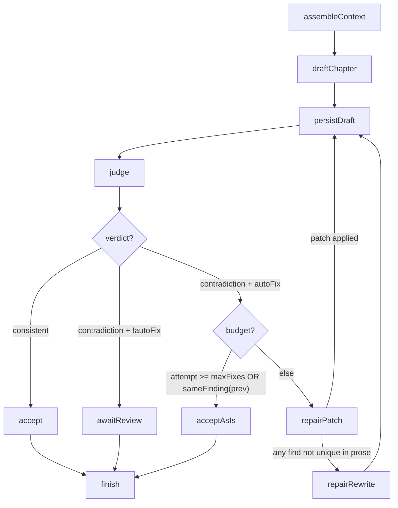
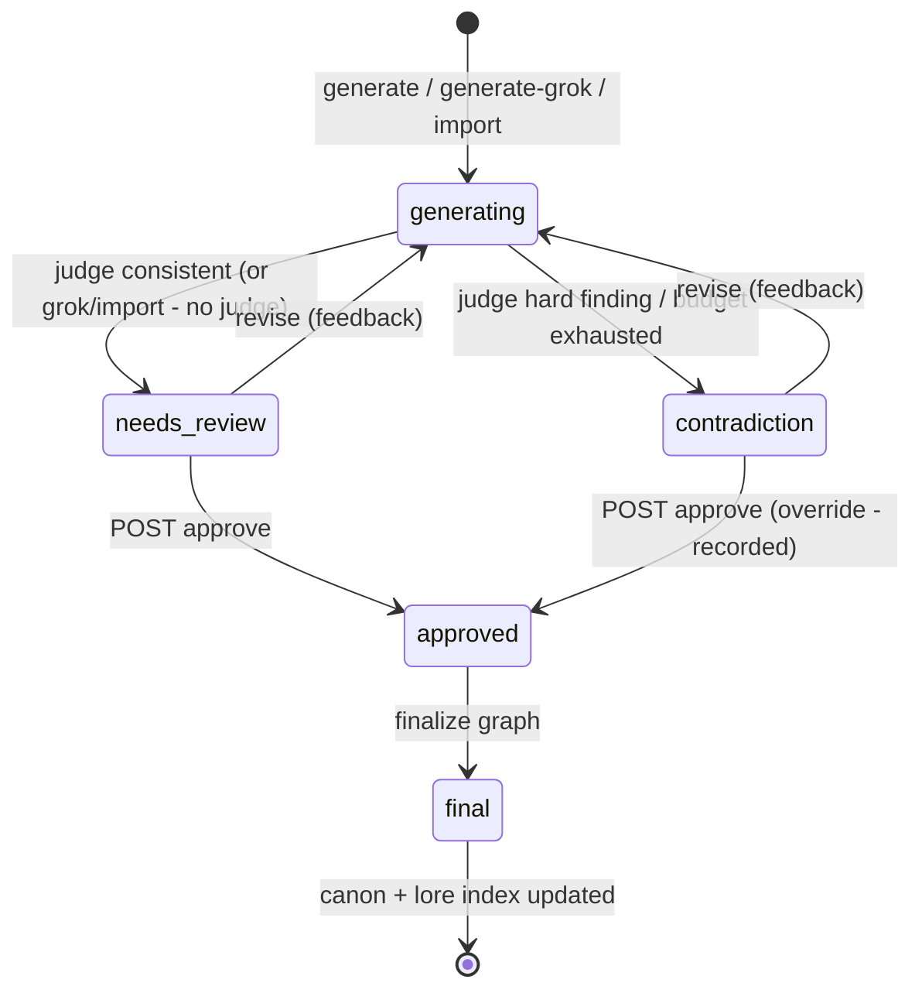

# AI System Design — Novel Forge Server

> **Purpose:** the definitive, implementation-ready blueprint for the AI subsystem of this server. A Claude Code session should be able to build the AI layer directly from this document.
> **Scope:** the AI layer only. Application scaffolding, CRUD modules, source scraping, jobs/concurrency, and the HTTP conventions are defined by `docs/python-cli-to-node-api-migration-plan.md` and are **not** re-designed here.
> **Standalone:** this document is the single source of truth for the AI layer; it supersedes the earlier AI architecture review, which has been removed.
> **Stack:** Bun + `@shadow-library/*` (Fastify, DI modules), PostgreSQL + Drizzle, pgvector.

---

## 1. AI Architecture

### 1.1 One-paragraph summary

Every multi-step AI operation runs as a **LangGraph `StateGraph` execution**, identified by a `workflow_runs` row and checkpointed to PostgreSQL, so a crash mid-generation resumes from the last completed node. Graph nodes are thin: they call injected **services** for context assembly, persistence, and retrieval, and call **LangChain** runnable chains (model router → prompt template → structured output → repair loop) for every model interaction. Context is **routed, not dumped**: the chapter-outliner selects, from a compact titles-only catalog of available canon, exactly which context each chapter needs (`briefs.contextRefs`); drafting receives only that selection plus a mandatory serial core, while **LlamaIndex.TS retrieval** over two pgvector indexes (prose + lore) informs the outliner's selection and powers the judge's lookup tools. Human review is **not** a paused graph: graphs always run to a terminal state, artifact status in domain tables _is_ the review state, and feedback starts a new graph run. Every model call and tool call is persisted with prompt version, tokens, latency, and raw output, so any failed generation is fully reconstructable from the database.

### 1.2 Library responsibilities — the boundary table

Most LangChain/LangGraph/LlamaIndex messes come from letting the libraries overlap. These boundaries are architecture, not convention — enforce them in review:

| Concern                                                                                        | Owner                               | Never does                                                                              |
| ---------------------------------------------------------------------------------------------- | ----------------------------------- | --------------------------------------------------------------------------------------- |
| Model construction, prompt templates, structured output, transient retries, tool _definitions_ | **LangChain**                       | persist anything; know about projects, graphs, or review state                          |
| Workflow state, sequencing, branching, retry loops, checkpointing                              | **LangGraph**                       | call models directly (nodes call LangChain chains); hold canon (domain tables do)       |
| Chunking, embedding, vector storage, retrieval                                                 | **LlamaIndex.TS**                   | call a chat LLM — no query engines, chat engines, or LLM postprocessors; retrieval only |
| Canon, artifacts, review state, telemetry, audit                                               | **PostgreSQL via Drizzle services** | —                                                                                       |

**Why each library earns its place:**

- **LangChain** — one abstraction over four providers (Anthropic, OpenAI, xAI, Ollama) with per-role routing, `withStructuredOutput(zod)`, `withRetry`, and a callback seam that writes telemetry without touching business code. Rewriting this per-provider is the alternative, and it is worse.
- **LangGraph** — durable execution. With `@langchain/langgraph-checkpoint-postgres`, a crash inside chapter 7's third repair attempt resumes at the judge node with the repaired prose intact instead of re-paying the drafting call. Conditional edges make the judge-verdict routing, patch-vs-rewrite fallback, and attempt budgets explicit topology — visible and testable — instead of `while` loops.
- **LlamaIndex.TS** — ingestion pipelines (chunking + metadata + embedding) and metadata-filtered retrievers over two logical pgvector indexes. Used strictly below the LLM line; synthesis belongs to LangChain. This prevents two competing LLM abstractions in one codebase.

**Why this is the simplest architecture that still scales:** there is exactly one execution path (run → graph → nodes → chains → services), one write path (Drizzle services, shared with the CRUD API), one context builder, one structured-output policy, and one telemetry sink. Nothing is duplicated; every component has a single owner. Scaling pressure (chapter-200 projects, weak local models, new workflows) is absorbed by configuration — token budgets, capability flags, new graph files — not by new architecture.

### 1.3 What must NOT use these libraries

- **Single LLM calls** (judge-only, review, skeleton, title salvage) are plain LangChain chains — a graph with one node is ceremony.
- **Deterministic logic** (consolidation, continuity write-back application, idempotent upserts, cursor advancement) is plain service code. Prefer deterministic application code over AI everywhere the Python app did.
- **CRUD and review endpoints** never touch LangChain/LangGraph — they read and mutate domain tables.
- **Drafting is never agentic.** No authoring node gets tools; no tool ever writes. The model _proposes_ structured output; graph-node code _disposes_ (§4.1).
- **Raw SQL vector queries** don't bypass LlamaIndex, and LlamaIndex doesn't own domain schema — the two vector tables are the only thing it touches.

### 1.4 Module layout

```
src/modules/ai/
  ai.module.ts                  DI module wiring everything below
  defaults.ts  models.ts        role→model profiles, capability flags, AI_PROFILE seam
  model-router.service.ts       chatFor(role) + structured() repair ladder
  telemetry.handler.ts          LangChain callback → model_calls
  context/                      ContextAssembler + catalog + ref resolution + sections + token budget
  retrieval/                    LlamaIndex ingestion + RetrievalService
  tools/                        registry, ToolContext, 6 read-only tools, tool loop
  prompts/                      versioned prompt modules (§5)
  schemas/                      Zod output schemas (shared contracts)
  graphs/                       the StateGraphs (§2) + workflow-run.service.ts
```

---

## 2. Workflow Design

### 2.1 Catalog

| Graph                     | Entry point                                                                                                                 | Mode | Human gate                                               |
| ------------------------- | --------------------------------------------------------------------------------------------------------------------------- | ---- | -------------------------------------------------------- |
| `chapter-generation`      | `generate` job — one run per chapter                                                                                        | job  | terminal `contradiction` / `needs_review`                |
| `chapter-revision`        | `POST /drafts/:n/revise`                                                                                                    | sync | always terminal `needs_review`                           |
| `chapter-finalization`    | `POST /finalize` — per chapter                                                                                              | sync | entered only from `approved`                             |
| `bible-builder`           | `POST /seed-from-brief`                                                                                                     | job  | user edits output; `force` re-seed                       |
| `source-extraction`       | `extract` job — one run per chapter                                                                                         | job  | none                                                     |
| `novel-validation`        | `POST /validate`                                                                                                            | job  | report reviewed by human                                 |
| _Plain chains (no graph)_ | volume-planner (`POST /plan`), chapter-outliner (`POST /outline`), judge-only, review, skeleton, title salvage, source-seed | sync | plans approved / briefs (incl. context list) hand-edited |

The `chapter-outliner` is a single structured call but plays a load-bearing role in context management: alongside each chapter's brief it selects the `requiredContext` refs that chapter will later draft against (§3.2).

Shared mechanics for **every** graph:

- **Invocation.** `WorkflowRunService` creates a `workflow_runs` row, invokes the compiled graph with `thread_id = run.id`, records a node trace, and sets the terminal status (`completed` / `awaiting_review` / `failed`). Jobs and sync endpoints share this service — one execution architecture, two invocation modes.
- **Checkpointing.** `PostgresSaver` snapshots state after every node. All node effects are idempotent upserts, so at-least-once node execution is safe — this invariant is what makes checkpointing sound. Crash recovery = re-invoke with the same `thread_id`. Checkpoints are pruned once a run reaches a terminal state.
- **Retry.** Transient model errors (408/429/5xx/connection/timeout) are retried _inside_ chains (`withRetry`, 4 attempts, 1s→30s backoff). Parse failures go through the repair ladder (§5.4). A chain that exhausts both throws; the graph marks the run `failed` with `{ node, class, message }`.
- **Persistence.** Nodes write through the same Drizzle services the CRUD API uses. Anything user-visible is flushed to domain tables by the node that produced it — **nothing user-visible may exist only in a checkpoint**.

### 2.2 `chapter-generation` (the core graph)

Draft chapter _n_ against canon, judge it, repair contradictions within a budget, land it in a reviewable state.

**State:**

```ts
interface ChapterGenerationState {
  // immutable input
  projectId: bigint;
  chapter: number;
  volumeKey: string;
  guidance: string;
  autoFix: boolean;
  maxFixes: number; // default 3
  // working data
  contextPackId: bigint | null; // assembled once; judge/repair reuse it
  prose: string;
  title: string;
  summary: string;
  continuationState: Record<string, string>;
  verdict: 'consistent' | 'contradiction' | null;
  findings: JudgeFinding[]; // { severity: 'hard' | 'soft', text: string }
  previousFindings: JudgeFinding[];
  attempt: number;
  repairMode: 'patch' | 'rewrite';
  // outcome
  draftId: bigint | null;
  outcome: 'accepted' | 'accepted_with_findings' | 'awaiting_review' | 'failed' | null;
}
```

**Nodes and transitions:**



- `assembleContext` — `ContextAssembler.forChapter(projectId, n)`: mandatory serial core + fresh resolution of the brief's `contextRefs` (§3.2); persists the pack, sets `contextPackId`. No LLM.
- `draftChapter` — generation chain. Missing title → inline title-salvage chain before persisting. Domain validation: non-empty prose, continuation state cleaned to known fields.
- `persistDraft` — upsert `drafts` + append `draft_revisions` (`source: generated | patched | rewritten`). Re-entrant (revision-keyed).
- `judge` — validation chain over the _same_ context pack + draft, with read-only tools (§4) — the tools give the judge access to canon the routed drafting pack deliberately omits. Writes the verdict onto the draft row immediately — user-visible even mid-run.
- `repairPatch` — FIX chain returns minimal find/replace edits; applied only if every `find` occurs exactly once in the prose (byte-identical untouched prose is the correctness guarantee); otherwise route to `repairRewrite`.
- `repairRewrite` — full re-draft with findings appended; canon refs cited by the findings are resolved and added to the pack so the rewrite sees exactly what it contradicted; `attempt++`, `previousFindings = findings`.
- Early stop — repeated finding (normalized-substring comparison) or budget exhaustion → `acceptAsIs`: draft kept with `contradiction` status and findings preserved; the human resolves via revise/edit.

**Failure handling:** a failed run stops the parent batch job (autopilot needs a working judge) but keeps completed chapters — they are already committed. **Human review points:** terminal `needs_review` or `contradiction` (§6). **Grok variant:** same graph with `forceProvider: 'xai'`, `autoFix: false`, and the judge node skipped by a conditional — human review replaces the judge.

### 2.3 `chapter-revision`

Rewrite a draft to explicit user feedback, then re-judge. One feedback note in, one new revision out — the loop across feedback rounds is _the human calling the endpoint again_, not graph recursion.

- **State:** `{ projectId, chapter, feedbackId, contextPackId, prose, title, summary, continuationState, verdict, findings, outcome }`.
- **Nodes:** `loadDraftAndFeedback` → `assembleContext` (fresh — the brief's `contextRefs` re-resolved; canon may have changed since drafting) → `revise` (serial core + resolved refs + current prose + feedback + last 5 feedback notes — no full memory dump) → `persistRevision` (revision++, `source: revised`, links `feedbackId`) → `judge` → `finish`.
- **Always terminal `needs_review`** — a revision is never auto-accepted even if consistent; the human asked for a change and must confirm it landed. No repair loop — the human is already in the loop; surfacing findings beats burning tokens.

### 2.4 `chapter-finalization`

Promote an approved draft to canon, in order, with the continuity write-back. Mostly deterministic, but its steps are individually fallible and must resume, not restart — that is why it is a graph.

- **State:** `{ projectId, chapter, draftId, prose, summary, continuationState, continuityDelta, generator, outcome }`.
- **Nodes:** `guard` (in-order check, draft `approved`) → `commitProse` (chapter upsert; draft → `final`) → `extractContinuity` (CONTINUITY chain over the final prose + a minimal entity roster — keys, aliases, status one-liners, not full cards; **skipped** for grok chapters) → `applyContinuity` (deterministic write-back: planned→active, register generated entities, tracker upserts) → `updateIndexes` (best-effort: prose chunks + refresh touched lore chunks) → `advanceCursor` → `finish`.
- **Tiered failure handling:** `commitProse` failure fails the run cleanly (nothing happened). `extractContinuity`/`applyContinuity` failure marks the run `failed` _after_ prose commit — re-invoking resumes at the failed node from checkpoint. `updateIndexes` is best-effort: log and continue (embedding failure never fails the chapter).
- **Continuity deltas route through the `continuity_proposals` staging table for all chapters** — `autoApply: true` for standard chapters, human-gated for grok. One write-back code path, one audit trail of what changed canon and why.

### 2.5 `bible-builder`

Six dependency-ordered stages as six nodes: `foundation` → `worldAndPower` → `factionsAndLocations` → `characters` → `plot` → `volumes`, then `indexLore` (embed seeded lore into `lore_chunks`).

- **State:** `{ projectId, brief, force, stagesDone: string[], counts: Record<string, number>, outcome }`.
- Each node: one structured call, idempotent keyed upserts, all rows `draft`/`planned`, skip-if-edited unless `force`. Per-node checkpointing means a failure at `characters` re-runs from `characters`, not `foundation` — with six sequential LLM calls this matters.
- **Context per stage:** each stage's prompt receives the seed brief plus only the outputs of the stages it depends on (e.g. `characters` sees foundation + world + factions, never the volume plan) — no stage gets the whole accumulated bible.
- **Retry:** one repair-ladder pass per node, then fail the run. Partial output is fine by design — every stage is independently editable and re-seedable.

### 2.6 `source-extraction`

Per chapter (the `extract` job drains the queue, one run per chapter): `loadChapter` → `extractKnowledge` (EXTRACTION chain over the chapter prose + known-entity roster — keys and aliases only) → `persistKnowledge` (idempotent transaction: entities/aliases/appearances/beats/threads/facts/mysteries/summary) → `embedProse` (best-effort) → `finish`. Consolidation stays a deterministic service outside the graph. Parse failure after repair → run `failed`, chapter re-armable, raw output already in `model_calls`.

### 2.7 `novel-validation`

Map-reduce so whole-novel validation fits any context window: `planWindows` (split chapters into volume-sized windows) → `validateWindow` (one call per window with the window's summaries + only the trackers/threads/facts whose chapter ranges touch the window, plus tools to reach outside it; LangGraph `Send` fan-out) → `mergeFindings` (dedupe by normalized finding, keep worst severity) → `persistReport`. State carries `windows[]`, `windowFindings[][]`, `report`.

---

## 3. Context Management

> Amended by `docs/interactive-refinement-design.md` §2.4: purposes gain `chat`, `arc_plan`, `premise`, `audit`, and every section carries a `segment: stable | volatile` marker (the provider prompt-cache contract).

### 3.1 The tier model

Every piece of context has a **canon status**; the assembler never mixes tiers silently:

| Tier                | Contents                                                                                                                               | Usage                                                                                  |
| ------------------- | -------------------------------------------------------------------------------------------------------------------------------------- | -------------------------------------------------------------------------------------- |
| **Canonical**       | finalized chapters (prose/summaries), bible docs, active/dead entities, applied trackers, approved volumes                             | ground truth; the judge judges _against_ this                                          |
| **Approved-intent** | approved volume plans, hand-edited briefs, `planned` entities                                                                          | intent to honor — prompts state "it is INTENT, not established canon; continuity wins" |
| **Working**         | unfinalized drafts of chapters `< n` (summaries + continuation state), pending continuity proposals                                    | included for serial continuity, always labeled `[draft — not yet canon]`               |
| **Excluded**        | grok prose (adjacency rule: summary+state instead), raw model outputs, other projects' data, discarded proposals, superseded revisions | never in any prompt                                                                    |

This is how **finalized knowledge differs from draft knowledge**: finalized content is unlabeled ground truth and is indexed for retrieval; draft content flows only through the Working tier, explicitly labeled, and is never embedded into any index.

### 3.2 Context routing: the brief declares what the chapter needs

Context is **routed, not dumped** — selection and consumption are two separate stages:

1. **Selection happens at outline time.** The `chapter-outliner` receives the **context catalog** — a compact, titles-only listing of the project's available knowledge: entities as `key — type, one-line descriptor (status)`, world-fact keys, open plot threads, unresolved mysteries, and one-line summaries of finalized chapters. The catalog costs a few hundred tokens; the full cards it points to cost thousands. Retrieval hits (prose + lore, queried by the volume objective) are appended to inform selection. For each chapter brief the outliner emits `requiredContext: string[]` — refs like `entity:iron_covenant`, `world_fact:mana_debt`, `thread:heir_mystery`, `chapter:12` — most-important first, validated at parse time against the catalog (invented refs are dropped and logged). Stored as `briefs.contextRefs`, hand-editable exactly like the rest of the brief.
2. **Resolution happens at generation time.** The assembler resolves exactly those refs — fresh from PostgreSQL, so the _content_ is current even though the _selection_ was made earlier — renders them as full cards / facts / thread summaries, and adds nothing else beyond the mandatory serial core.

**The mandatory serial core is always present**, regardless of what the brief selected: previous-chapter ending (verbatim tail; summary+state if grok), continuation state + current situation, the brief itself + current volume objective, the writing style, and a short recent-summaries window (last 3, configurable). Without this core the drafter branches the story; with it, "only what the brief mentions" is safe — the brief declares everything _situational_, the core guarantees everything _serial_.

**Resolution rules:** unknown or renamed refs are skipped and recorded on the pack manifest (`unresolvedRefs`) — never a failure. A brief with no `contextRefs` (hand-written, imported, pre-routing) falls back to broad legacy assembly with a warning. Resolved refs are deduped against core sections by `refKey`.

**Selection mistakes are corrected downstream, not prevented upstream:** the judge keeps read-only tools over _all_ canon, so a contradiction with un-selected canon is still caught; when a finding cites canon the drafter never saw, `repairRewrite` resolves those cited refs into the pack; and the reviewer can edit the brief's context list and revise. This is the deliberate trade — the drafter sees less, so the judge's adversarial lookup matters more.

### 3.3 What lives where

- **PostgreSQL (deterministic reads)** — the mandatory core plus every resolved ref. At draft time identity is always known (the brief declared it), so drafting context is fully reproducible from the brief alone. Deterministic-first remains the key rule: a serial story needs _guaranteed_ recall of adjacent context; similarity search is never the only path to it.
- **LlamaIndex retrieval** — three places only: outline time (informs `requiredContext` selection), verification tools (`search_lore` / `search_prose`), and the user-facing search endpoint. **Never at draft time.** Retrieval is additive and best-effort; empty results degrade gracefully.
- **Graph state** — _working products of this run only_: prose being repaired, findings, attempt counters, and a `contextPackId` reference. **Never put assembled canon text in graph state** — it bloats every checkpoint and goes stale mid-run; nodes re-read the pack by id.
- **Prompts** — only the rendered `ContextPack` plus operation-specific inputs (guidance, feedback, findings, target words).
- **Never sent to the LLM:** database ids, JSONB blobs, tool schemas a node doesn't use, other projects' data, grok prose in non-grok context, raw prior model outputs, superseded draft bodies, checkpoint internals, the catalog outside the outliner, roster/world-doc dumps at draft time.

### 3.4 Per-job context matrix

Every AI job receives exactly this — nothing more:

| Job / node                  | Always (core)                                                                             | Routed / job-specific                                                           | Explicitly excluded                                             |
| --------------------------- | ----------------------------------------------------------------------------------------- | ------------------------------------------------------------------------------- | --------------------------------------------------------------- |
| `chapter-outliner`          | volume plan + objective, serial memory (volume epitomes + recent summaries), open threads | context catalog (titles only), retrieval hits                                   | full entity cards, prose bodies                                 |
| `draftChapter`              | serial core (§3.2)                                                                        | resolved `contextRefs`                                                          | catalog, cast-roster dumps, world-doc dumps, retrieval          |
| `judge`                     | the generation pack (reused) + the draft                                                  | read-only tools over all canon                                                  | —                                                               |
| `repairPatch`               | findings + current prose + continuation state                                             | —                                                                               | the rest of the pack (a patch must not "improve" anything else) |
| `repairRewrite`             | the generation pack + findings                                                            | refs cited by findings, resolved and appended                                   | —                                                               |
| `revise`                    | serial core + current prose + feedback (last 5 notes)                                     | brief's `contextRefs` re-resolved fresh                                         | full memory dump                                                |
| `extractContinuity`         | final prose                                                                               | entity roster (keys, aliases, status one-liners), open thread keys              | full cards, world docs                                          |
| `extractKnowledge` (source) | chapter prose                                                                             | known-entity roster (keys + aliases)                                            | everything else                                                 |
| `bible-builder` stages      | seed brief                                                                                | outputs of dependency stages only                                               | later / independent stages' output                              |
| `volume-planner`            | vision + foundation docs                                                                  | volume epitomes, open threads, unresolved mysteries                             | chapter-level detail                                            |
| `validateWindow`            | window chapter summaries                                                                  | trackers/threads/facts whose chapter ranges touch the window; tools for outside | other windows' prose                                            |
| `review` (quality)          | chapter prose + its brief + style                                                         | —                                                                               | canon trackers                                                  |
| title salvage               | prose head                                                                                | —                                                                               | everything else                                                 |

### 3.5 The Context Assembly Service

One service, `ContextAssembler` (`modules/ai/context/`), with one public method per purpose (`forChapter`, `forRevision`, `forValidationWindow`, `forOutline`) plus `catalog(projectId)` (renders the titles-only catalog) and `resolveRefs(projectId, refs)` (shared by generation, revision, and the repair-rewrite augmentation). Pipeline:

```
1. CORE      deterministic reads of the purpose's mandatory sections (one round of parallel queries)
2. RESOLVE   briefs.contextRefs → full cards / facts / thread summaries (fresh reads; unknown refs → manifest)
3. RETRIEVE  outline + validation purposes only (prose index + lore index)
4. BUDGET    token-count each section; fill in priority order until the budget; evict lowest-priority first
5. RENDER    fixed section order, fixed section labels (labels are part of the prompt contract)
6. PERSIST   context_packs row — the exact text the model saw, plus a manifest
```

**Generation-pack priority order** (highest first — evicted last):

1. Previous-chapter ending (verbatim tail; summary+state if the previous chapter is grok)
2. Continuation state + current situation
3. This chapter's brief; current volume objective
4. Resolved `contextRefs`, in brief order — the outliner's ordering _is_ the eviction order, which is why the outline prompt demands most-important first
5. Recent-summaries window (last 3)
6. Writing style

Other purposes have their own short section lists per the §3.4 matrix; the outline pack's lowest-priority sections are the retrieval hits, then the catalog's chapter one-liners (oldest first).

**Token limits.** Count tokens with `js-tiktoken` (`o200k_base` as the universal approximation — consistency matters, exactness doesn't). Budget = `min(model context, config generate.context_tokens, default 24k)` minus a fixed reserve for system prompt, operation inputs, and output `max_tokens`. Per-section token caps (e.g. volume objective 600, resolved entity card 350, world fact 150). Truncate at paragraph boundaries, never mid-sentence; record `truncated: true` in the manifest. Routing usually keeps packs far below budget; the budget is the backstop for a brief that selects too many refs — excess refs are evicted from the tail and recorded.

**Avoiding duplicated context.** Each fact has exactly one home section: resolved refs are deduped against core sections by `refKey`, and the ref list itself is a set. The pack is assembled once per run and reused by draft/judge/repair within it.

**Preventing stale context.** Content staleness cannot happen: refs are resolved fresh at assembly time, so an entity edited after outlining renders with its current card. Selection staleness (canon added after outlining that the brief never selected) is covered by the judge's tools, the repair-rewrite augmentation, and the hand-editable context list. Canon rows are read at assembly; a bible edit mid-run affects the _next_ run (documented behavior). Conflicts _within_ canon are what `novel-validation` exists to find — the assembler never attempts LLM-based reconciliation.

**Large projects (the chapter-200 problem).** Routing _is_ the answer: the generation pack is O(core + selected refs), independent of project size. Two supports keep the _outliner_ scalable: (a) the lore index feeds its retrieval hits; (b) **volume epitomes** — when a volume's last chapter finalizes, a one-time analysis call writes a ~200-token summary onto `volumes.epitome`, so the outliner's serial memory is O(volumes) not O(chapters). Add (b) when any project crosses ~3 volumes.

### 3.6 The `ContextPack` contract

```ts
interface ContextPack {
  id: bigint;
  projectId: bigint;
  purpose: 'generation' | 'judge' | 'revision' | 'validation' | 'outline';
  chapter: number | null;
  hash: string; // sha256 of rendered text — dedupe + cache key
  budgetTokens: number;
  usedTokens: number;
  sections: ContextSection[]; // the manifest — what got in, what got cut
  unresolvedRefs: string[]; // contextRefs that no longer resolve (renamed/deleted canon)
  rendered: string; // exactly what the model saw
}

interface ContextSection {
  key: string; // 'prev_ending' | 'brief' | 'memory' | 'cast_full' | 'lore_retrieved' | ...
  tier: 'canonical' | 'approved_intent' | 'working';
  tokens: number;
  truncated: boolean;
  sourceRefs: string[]; // e.g. ['chapter:12', 'entity:iron_covenant', 'volume:v03']
}
```

The manifest answers "why did the model contradict chapter 12?" — either `chapter:12` was never in the brief's `contextRefs`, or it was evicted at budget time, or it failed to resolve; all three are visible in the pack. `GET /projects/:id/context/preview?chapter=n&purpose=generation` runs the assembler dry (nothing persisted) for debugging.

---

## 4. Tool Calling

### 4.1 Design stance: tools verify, they never author or write

- **Authoring nodes** (`draftChapter`, `revise`, `repairPatch`/`repairRewrite`, all `bible-builder` stages): **zero tools.** Context is pushed deterministically, output is structured, done. An agent that fetches its own context produces non-reproducible runs, unbounded spend, and continuity holes when it doesn't think to look something up.
- **Verification nodes** (`judge`, `validateWindow`, `review`): **read-only tools.** The judge's job is adversarial lookup — "did anything earlier contradict this?" — exactly what on-demand retrieval is for and exactly what a fixed context window is bad at.
- **Write tools: none, ever.** All persistence is graph-node code. The model _proposes_ via structured output; code _disposes_. This one rule eliminates the entire class of unsafe-tool-call guardrails.

**Tools vs. application services:** if the _code_ knows what data is needed (context assembly, persistence, indexing, consolidation), it is a service call in a node. A tool exists only where the _model_ must decide what to look up at inference time — which in this system is verification, nowhere else.

### 4.2 Registry and permissions

```ts
interface RegisteredTool {
  name: string;
  description: string; // model-facing; write carefully — it is prompt text
  inputSchema: z.ZodType;
  outputSchema: z.ZodType; // validated before the result re-enters the conversation
  handler: (input: unknown, ctx: ToolContext) => Promise<unknown>;
  maxCallsPerRun: number; // exceeded ⇒ tool returns an error string, run continues
  tokensBudget: number; // results truncated to this many tokens
}

interface ToolContext {
  // injected by the executing node — never model-supplied
  projectId: bigint;
  runId: string;
  chapter: number | null;
  db: PrimaryDatabase; // repositories, not raw SQL
  retrieval: RetrievalService;
}
```

`ToolRegistryService` holds the definitions; a node requests `registry.forNode('judge')` and gets LangChain `tool()` bindings for its allowlist only. **`projectId` never appears in an input schema** — handlers take it from `ToolContext`, so the model cannot cross project boundaries by construction.

### 4.3 The v1 tool set (deliberately small — six tools)

| Tool                    | Input schema               | Returns                                                              | Allowed in                    |
| ----------------------- | -------------------------- | -------------------------------------------------------------------- | ----------------------------- |
| `search_lore`           | `{ query, kinds? }`        | top-6 lore cards (canonical tier only)                               | judge, validateWindow, review |
| `get_entity`            | `{ entityKey }`            | full entity card: attributes, status, relationships, first/last seen | judge, validateWindow, review |
| `get_chapter_summaries` | `{ from, to }` (span ≤ 20) | numbered summaries for the span                                      | judge, validateWindow         |
| `search_prose`          | `{ query, k? ≤ 8 }`        | prose snippets with chapter numbers (grok excluded)                  | judge, review                 |
| `get_world_facts`       | `{ category? }`            | keyed facts for the category                                         | judge, validateWindow         |
| `get_plot_threads`      | `{ status? }`              | thread summaries with opened/closed chapters                         | judge, validateWindow         |

No `save_draft`, no `update_index`, no `fetch_project_context` — saving and indexing are graph nodes, and project context is pushed by the assembler. A future "chat with your lore bible" feature reuses this same read-only registry; that is the growth path.

### 4.4 Execution, validation, errors, audit

- **Loop:** verification nodes run a bounded tool loop (LangChain `bindTools` + manual loop, **max 6 rounds**) before demanding the final structured verdict. Cap exceeded ⇒ inject "tool budget exhausted — answer with what you have."
- **Input validation:** Zod-parse the model's arguments; on failure return the error message _as the tool result_ (models self-correct well on `"error: 'from' must be a number"`) — don't crash the node. Two consecutive invalid calls to the same tool ⇒ disable that tool for the run.
- **Output validation:** handler results are Zod-validated and token-truncated before re-entering the conversation. A handler exception returns `"error: lookup failed"` to the model and logs the real error — a broken tool degrades the judge to brief-only judging instead of failing the run.
- **Audit:** every invocation writes a `tool_calls` row: `{ runId, modelCallId, node, tool, args, resultDigest, status: 'ok' | 'invalid_args' | 'handler_error' | 'budget_exceeded', latencyMs }`. The per-run trace renders in `GET /runs/:id/tool-calls`.
- **Weak-model fallback:** if the routed model's capability flag says `tools: false` (§8.5), verification nodes skip tool binding entirely and judge brief-only — same graph, capability-degraded, never broken.

---

## 5. Prompt Architecture

> Amended by `docs/interactive-refinement-design.md` §2.5: `PromptModule` gains `role` (routing when it differs from the key) and `cacheStrategy` (stable-first message ordering with Anthropic cache breakpoints injected by the router).

### 5.1 Folder structure

```
src/modules/ai/prompts/
  index.ts                     registry: Record<PromptKey, PromptModule>
  authoring-preamble.ts        AUTHORING_STYLE constant — prepended to authoring prompts only
  generation.prompt.ts         judge.prompt.ts  fix.prompt.ts  revision.prompt.ts
  outline.prompt.ts  title.prompt.ts  extraction.prompt.ts  continuity.prompt.ts
  validation.prompt.ts  review.prompt.ts  new-novel.prompt.ts  plan.prompt.ts  skeleton.prompt.ts
  bible-builder/               one file per stage: foundation / world-power / factions-locations / characters / plot / volumes
src/modules/ai/schemas/        Zod output schemas — imported by prompt modules AND tests (shared contracts)
```

```ts
interface PromptModule<TOut> {
  key: PromptKey;
  version: string; // '1.0.0' — bump on ANY wording change; logged on every model_call
  kind: 'authoring' | 'analytical'; // authoring ⇒ AUTHORING_STYLE prepended; analytical ⇒ never
  system: string;
  template: ChatPromptTemplate;
  schema: z.ZodType<TOut>;
  fewShots?: BaseMessage[];
}
```

### 5.2 System / task / context strategy

- **System prompt** = role identity + hard rules only, ported verbatim from the Python `_*_SYSTEM` constants (they encode tuned behavior — e.g. continuity-over-beats precedence, judge severity definitions). Static per version ⇒ prompt-cache friendly.
- **Human/task message** = the rendered `ContextPack` + operation inputs (guidance, feedback, findings), in that order, with the pack's fixed section labels intact — the labels are part of the contract the prompts were tuned against. Templates take the pack as a single pre-rendered `contextPack` string variable; **templates never fetch data**.
- **Few-shot examples:** not for authoring (they anchor style harder than the style doc — harmful). Exactly two places: the **judge** (one CONSISTENT example, one hard-contradiction example) and **fix** (one minimal-patch example showing find-string discipline). Kept in the prompt module, versioned with it.

### 5.3 Versioning

Prompt text lives in code — reviewed in PRs, not editable at runtime; a prompt is behavior. `version` bumps on any wording change; `model_calls.promptKey/promptVersion` makes drift measurable ("did judge acceptance rate move after judge@1.2.0?" is one SQL query). No prompt-text DB table — a second source of truth is worse than none.

### 5.4 Structured output: the repair ladder

Every structured call runs this ladder, implemented **once** in `ModelRouterService.structured(chain, schema)`:

1. Native structured output (tool-use / JSON mode) → Zod parse. Success ⇒ `status: ok`.
2. Parse failure ⇒ **repair**: re-invoke once with the original output + the Zod issues rendered plainly. Success ⇒ `status: repaired`.
3. Second failure ⇒ tolerant extraction (first balanced `{…}` block) → Zod parse.
4. Still failing ⇒ `AiResponseError` → `AI_001`; the raw output is already persisted in `model_calls` (trace-first: raw output is written _before_ parsing).

For prompt-directive providers (some Ollama models, subprocess CLIs) step 1 is a JSON directive appended to the prompt; steps 2–4 are identical. Cost: at most one extra call, only on failure — the insurance that matters most for local models.

**Zod discipline:** port every Python JSON schema to Zod **with the `.describe()` texts preserved** (descriptions steer the model). Add `z.enum` for closed sets, `.min(1)` on prose, and cross-field refinements only where the Python code enforced them post-hoc. Schemas are the single source for `withStructuredOutput`, output validation, mock fixtures, and DTO alignment. The outline schema adds `requiredContext: string[]` per brief, with a `.describe()` instructing selection from the catalog only, most-important first; it is post-validated against the catalog — invented refs are dropped and logged, and ordering is preserved (it doubles as the eviction priority, §3.5).

**The judge is structured, with identical acceptance semantics:**

```ts
const JudgeSchema = z
  .object({
    verdict: z.enum(['consistent', 'contradiction']),
    findings: z.array(
      z.object({
        severity: z.enum(['hard', 'soft']).describe('hard = contradicts established canon and blocks acceptance; soft = wrinkle worth noting'),
        text: z.string().describe('one finding, citing the canon it conflicts with (chapter or tracker)'),
      }),
    ),
  })
  .refine(j => j.verdict === 'consistent' || j.findings.some(f => f.severity === 'hard'), { message: 'a contradiction verdict must include at least one hard finding' });
```

Post-parse normalization preserves the battle-tested semantics exactly: any hard finding ⇒ contradiction regardless of the verdict field; all-soft ⇒ consistent-with-notes; empty-findings contradiction rejected (fail-closed). The legacy `CONSISTENT`/`[HARD]` text protocol survives as the weak-model fallback variant, selected by the same capability flag as tool support.

### 5.5 Prompt testing

Three cheap layers: **render tests** (golden-file snapshot of the fully rendered prompt for a fixed seeded project — catches wording drift, asserts `AUTHORING_STYLE` presence iff `kind: 'authoring'`); **schema tests** (fixtures of known-good and known-bad model outputs per schema; assert parse/repair/fail behavior); **behavioral smoke** against a local model (§8) asserting _shape_, not content.

---

## 6. Human Review

### 6.1 Design decision: review state lives in the database, not in paused graphs

LangGraph's `interrupt()` is the textbook human-in-the-loop answer and the wrong one here. A chapter can sit awaiting review for days; a suspended graph thread puts user-visible state inside checkpoint blobs, makes every review action a fragile thread-resume, and means "what needs my review?" requires deserializing LangGraph internals. Instead: **graphs always terminate; artifact status is the review state; feedback launches the next graph.** `interrupt()` is reserved for a future genuinely-interactive feature — unused in v1.

### 6.2 The lifecycle

```
Draft ──► User Review ──► Revision ──► Approval ──► Canonical Storage ──► Knowledge Index Update
              ▲               │
              └───────────────┘  (as many rounds as needed)
```



`drafts.reviewStatus pgEnum('generating', 'needs_review', 'contradiction', 'approved', 'final')` is the human-loop substate; the existing `drafts.status draft|final` stays as the canon gate. Hand-edits (`PUT /drafts/:n`) append a `draft_revisions` row (`source: hand_edited`) and reset `approved → needs_review` — an edit invalidates a prior approval.

### 6.3 The loop, step by step

1. **Draft** — a `chapter-generation` run ends `needs_review` (or `contradiction` with findings attached).
2. **User review** — the reviewer sees the draft, the judge's findings with severities, and the context-pack manifest (_what the model knew_ — reviewable, which no other artifact provides).
3. **Revision** — `POST /drafts/:n/feedback { note, disposition: 'revision_requested' }` → `user_feedback` row → starts a `chapter-revision` run. Prior revision bodies are preserved in `draft_revisions`; feedback history (last 5 notes) rides along in revision prompts so rejected patterns don't come back. If the root cause is missing context rather than bad prose, the fix is editing the brief's context list (`briefs.contextRefs`) before revising — the revision re-resolves it fresh. Repeat 2–3 as needed.
4. **Approval** — `POST /drafts/:n/approve` → `user_feedback(disposition: approved)` + `reviewStatus: approved`. Approving over a standing contradiction verdict is allowed but recorded — the human outranks the judge, and the audit trail says so. Approval is deliberately separate from finalization so finalize can later be batched without weakening the human gate.
5. **Canonical storage** — the `chapter-finalization` graph commits prose to `chapters`, routes the continuity delta through `continuity_proposals` (autoApply for standard chapters), flips planned→active, registers generated entities, upserts trackers.
6. **Knowledge index update** — `updateIndexes` embeds the chapter's prose chunks and refreshes every `lore_chunks` row the delta touched. From this moment the chapter's knowledge is retrievable by all future runs.

The same shape covers every reviewable artifact: continuity proposals (propose → edit → apply/discard), volumes (draft → edit → approve gate), bible documents (seed as `draft` → edit). One pattern everywhere: **AI writes drafts into domain tables; humans mutate status; status gates the next graph.**

### 6.4 Supporting tables and endpoints

- **`draft_revisions`** — immutable revision history: `{ draftId, revision, source: 'generated' | 'patched' | 'rewritten' | 'revised' | 'imported' | 'hand_edited', body, summary, state, runId?, feedbackId? }`, unique `(draftId, revision)`. `drafts` keeps the current body (hot path unchanged).
- **`user_feedback`** — `{ projectId, artifactType, artifactRef, disposition: 'revision_requested' | 'approved' | 'rejected' | 'comment', note }`. Feeds revision prompts and the approval audit trail.
- **Endpoints:** `POST /drafts/:n/feedback`, `POST /drafts/:n/approve`, `GET /drafts/:n/revisions` (+ `/:r` for diff view), `GET /projects/:id/review-queue` (everything `needs_review` / `contradiction` / pending-proposal — the reviewer's inbox).

---

## 7. Knowledge Retrieval

### 7.1 Two logical indexes, both pgvector, both `projectId`-filtered

1. **Prose index** (`chapter_chunks`, `vector(1024)`) — finalized chapter prose only. Chunked at paragraph boundaries (~2000 chars). Written on finalize/extract/backfill; **delete-by-(project, chapter) before re-add** keeps it idempotent.
2. **Lore index** (`lore_chunks`, new) — one document per canonical knowledge item: entity card (name, type, status, attributes, relationship lines, body), world fact, plot-thread summary, mystery, volume epitome. Unique `(projectId, kind, refKey)`; HNSW index on the embedding. This is what makes "reuse prior generated knowledge" real: chapter-47 context can retrieve chapter-9 lore that no fixed brief section would include.

### 7.2 Indexing, updating, rebuilding

- **Ingestion** is a LlamaIndex pipeline wrapped in `RetrievalService`: chunk → attach metadata (`projectId`, `chapter`, `kind`, `refKey`, `canonStatus`) → embed → store. Embedding is **best-effort everywhere** — failure never fails the parent operation — and serialized under the local concurrency key (embeddings run on Ollama).
- **Updates:** lore rows carry `sourceUpdatedAt`; when a source row changes (bible edit, continuity write-back), the touched lore chunks are re-rendered and re-embedded (upsert-by-key). The finalization graph's `updateIndexes` node does this for delta-touched rows; a CRUD edit to a bible document or entity triggers the same upsert.
- **Rebuild:** a backfill script re-renders and re-embeds an entire project's indexes from domain tables — indexes are always derived data, never truth, so a rebuild is safe at any time.
- **Draft content is never indexed.** Only finalized prose and canonical lore enter the indexes — this is the retrieval-side enforcement of the tier model (§3.1).

### 7.3 Embedding and retrieval strategy

- **Embedding model:** `ollama/qwen3-embedding:8b`, dim 1024 (shared `EMBEDDING_DIM` constant; a dim change is a migration, not a runtime branch). Tests use `qwen3-embedding:0.6b` truncated to 1024 — same family, same dimension path.
- **Retrieval:** `VectorIndexRetriever` with metadata filters; `retrieve(projectId, query, { index, k, excludeGrok: true })` returns `{ text, score, metadata }[]`. No query engines, no synthesis — retrieval only.
- **Exclusions:** grok chapters are excluded from prose retrieval; `grok_only` projects retrieve `[]` (no substitute embedder — fail closed).

### 7.4 Exactly when retrieval happens

| Moment                                                        | Index       | Query                                                                                  |
| ------------------------------------------------------------- | ----------- | -------------------------------------------------------------------------------------- |
| `chapter-outliner` (brief creation)                           | both        | volume objective first line + latest summary — hits inform `requiredContext` selection |
| Judge / validation tool calls (`search_lore`, `search_prose`) | per tool    | model-supplied, at inference time                                                      |
| `GET /projects/:id/search` (user-facing semantic search)      | either/both | user-supplied                                                                          |

Nowhere else. Drafting never retrieves — its context is fully declared by the brief (§3.2); persistence never queries; retrieval never writes.

---

## 8. Local LLM Testing

### 8.1 The four-rung pyramid

Verify that graphs route, tools bind, schemas parse, context assembles, and persistence lands — with zero paid tokens. Each rung tests only what the rung below cannot:

| Rung                         | Model                    | Speed   | Proves                                                                   |
| ---------------------------- | ------------------------ | ------- | ------------------------------------------------------------------------ |
| 1. Mocked router             | none (scripted fixtures) | ms      | business logic, graph transitions, persistence, idempotency              |
| 2. Fake graph nodes          | none                     | ms      | graph topology in isolation (edges, state merging)                       |
| 3. Local LLM integration     | Ollama                   | sec–min | real tokenization / JSON quirks / tool-call formats survive the plumbing |
| 4. Paid smoke (manual, rare) | prod models              | —       | provider-specific structured output + refusal behavior                   |

Rungs 1–2 run in CI on every commit. Rung 3 runs locally and nightly (needs an Ollama host; skip-with-warning when absent, never red). Rung 4 is a hand-run script, never CI.

### 8.2 Runtime and recommended models

- **Runtime: Ollama** (primary) — it is already a first-class production provider, so the test path _is_ a production path. **LM Studio** is a supported developer-convenience alternative (same OpenAI-compatible API surface); nothing in the test suite depends on which one serves the model.
- **Chat model:** `qwen3:8b` — good JSON + native tool-calling in Ollama, fits consumer hardware. Fast lane: `qwen3:4b` or `llama3.2:3b` where quality is irrelevant. **Pin exact tags** in the test profile so results don't drift with `latest`.
- **Embedding model:** `qwen3-embedding:0.6b` truncated to 1024 dims — same family and dimension as production, ~13× smaller.
- **Determinism:** `temperature: 0`, fixed `seed`, pinned `num_ctx`. This is repeatable-ish, not deterministic — hence the rule: **rung 3 asserts shape, not content.**

### 8.3 The `AI_PROFILE` seam

One env var selects the role→model profile at bootstrap: `AI_PROFILE=prod | local-test | mock`. `local-test` maps every role to the pinned Ollama models; `mock` short-circuits `ModelRouterService` to the scripted router. **No test ever monkey-patches a provider SDK** — the router is the single seam. Per-project config overrides still apply on top (itself a test case).

### 8.4 Mocked model testing (rung 1)

`FakeModelRouter implements ModelRouterService`: `enqueue(promptKey, output | Error)` FIFO per key, plus `defaultFor(promptKey, factory)`. Outputs are **built from the real Zod schemas**, so a schema change breaks fixtures loudly. It records every call for spy assertions ("no Anthropic model constructed for a grok_only project"). For tool-using chains, the fake returns scripted `tool_calls` messages so the loop executes **real handlers** against the test DB — tool handlers are always real; only the model is fake.

### 8.5 What each test class covers

- **Context routing tests (rung 1):** catalog render golden; outline schema drops invented refs and preserves ordering; ref resolution (fresh content after a canon edit, unknown-ref skip → `unresolvedRefs`, zero-ref legacy fallback); per-purpose pack goldens asserting the §3.4 matrix — the generation pack contains the serial core + resolved refs and _nothing else_.
- **Graph testing (rung 2):** build each `StateGraph` with fake node functions; assert topology — contradiction routes to repair only when `autoFix`; patch-uniqueness failure routes to rewrite; repeated finding early-stops; budget exhaustion ⇒ `acceptAsIs`; **checkpoint-resume**: kill between nodes, re-invoke same `thread_id`, assert `draftChapter` executed once.
- **Tool testing (rung 1, real handlers):** per tool — happy path, projectId isolation (cannot see project B), arg-validation error string, call budget, output truncation, `tool_calls` audit rows.
- **Retrieval testing (rung 3-lite: real embedder, no chat model):** seed 3 chapters + lore; prose search returns the right chapter; lore search returns the right entity; grok chapters excluded; `grok_only` retrieves `[]`; edit-driven re-embed (`sourceUpdatedAt` newer ⇒ refresh).
- **Structured output testing:** schema fixtures (rung 1: ok/repaired/extracted/`AI_001` ladder paths, judge normalization corners) plus a rung-3 **torture test**: run each schema 5× against the local model, record parse/repair/fail counts to a report file — a regression tripwire, not a hard gate.
- **End-to-end workflow (rung 3, ~6 scenarios):** (1) seed-from-brief on a 3-sentence brief ⇒ every bible section has rows, all Zod-parsed; (2) generate chapter 1 of the micro-project ⇒ prose 300+ words, valid continuation state, judge returns a verdict; (3) judge a fixture draft that kills an already-dead character ⇒ hard assertion: verdict parses; soft assertion (logged, non-failing): verdict is contradiction; (4) fix-loop on a planted unique find-string ⇒ patch applies byte-identically outside the edit; (5) judge tool loop against seeded canon ⇒ valid `tool_calls` rows, no crash, final verdict parses; (6) the torture report.
- **Smoke test:** `bun run ai:smoke` — one end-to-end micro-novel on Ollama: seed → plan → approve → generate 2 chapters (autofix) → feedback + revise → approve → finalize both; assert canon rows, `lore_chunks`, `model_calls`/`tool_calls` populated, checkpoints pruned; print a run report (tokens, latency, parse stats).

**Capability flags** make weak models a tested feature, not a failure mode: `models.ts` entries carry `capabilities: { tools: boolean, structured: 'native' | 'json_directive' }`; verification nodes and the repair ladder branch on them, and tests assert both branches.

### 8.6 Fixtures and commands

`scripts/seed-ai-fixtures.ts` builds the **micro-project**: 1 project, minimal filled bible (1 approved volume, 4 characters, 6 world facts, 2 threads), 2 finalized chapters with summaries + continuation state, briefs for chapters 3–4 (with `contextRefs`) — small enough for any local model's window, rich enough that every assembler section is non-empty. Contradictory / patchable / title-less fixture drafts live under `tests/fixtures/ai/`.

| Command                     | Runs                                             | Needs                             |
| --------------------------- | ------------------------------------------------ | --------------------------------- |
| `bun test`                  | everything except `tests/ai/local`               | template DB                       |
| `bun run test:ai:unit`      | prompts, schemas, context, router                | template DB                       |
| `bun run test:ai:graph`     | topology + checkpoint resume                     | template DB                       |
| `bun run test:ai:tools`     | registry, handlers, isolation, audit             | template DB                       |
| `bun run test:ai:retrieval` | both indexes round-trip, filters, re-embed       | template DB + Ollama (embed only) |
| `bun run test:ai:local`     | the 6 rung-3 scenarios, serialized               | Ollama, pinned models             |
| `bun run ai:smoke`          | end-to-end micro-novel                           | Ollama, `AI_PROFILE=local-test`   |
| `bun run ai:pull-models`    | pulls pinned test models, clear error if missing | Ollama                            |

---

## 9. Observability

### 9.1 What gets recorded, where

| Signal                                                                                                                                                                                                  | Sink                                     | Written by                                                                             |
| ------------------------------------------------------------------------------------------------------------------------------------------------------------------------------------------------------- | ---------------------------------------- | -------------------------------------------------------------------------------------- |
| Graph execution: status, outcome, per-node trace `[{ node, startedAt, ms, status }]`, error `{ node, class, message }`                                                                                  | `workflow_runs`                          | `WorkflowRunService` lifecycle hooks                                                   |
| Every LLM call: node, role, provider, model, `promptKey@promptVersion`, status (`ok/parse_error/repaired/refused/transport_error/timeout`), input/output tokens, latency, cost, attempt, **raw output** | `model_calls`                            | one LangChain callback handler on every chain — telemetry never lives in business code |
| Every tool call: node, tool, args, result digest, status, latency                                                                                                                                       | `tool_calls`                             | tool-loop wrapper                                                                      |
| Exact model-visible context (rendered text + section manifest)                                                                                                                                          | `context_packs`                          | ContextAssembler                                                                       |
| Retrieval queries: query, index, k, hit refs + scores                                                                                                                                                   | structured log + the pack's `sourceRefs` | RetrievalService                                                                       |
| User decisions: feedback, approvals, contradiction overrides, proposal edits                                                                                                                            | `user_feedback`, `continuity_proposals`  | review endpoints                                                                       |
| Validation/repair outcomes                                                                                                                                                                              | `model_calls.status` + `error`           | repair ladder                                                                          |
| App logs (node start/end, lock waits, degradations)                                                                                                                                                     | framework `Logger`, structured           | everywhere                                                                             |

Rules that make this work:

- **Trace-first:** `rawOutput` is written _before_ parsing — it must survive a parse failure. This is the non-negotiable invariant.
- **One correlation key:** `runId` appears on logs, `model_calls`, `tool_calls`, `draft_revisions`, and the job's `progress.currentRun`.
- **Prompts are not stored per call** — the exact prompt is recoverable from `contextPackId` + `promptKey@version` + input refs; an env-gated debug mode stores it verbatim when needed.
- **Retries and failures** are visible as `model_calls.attempt` + `status`, and `workflow_runs.error` names the failing node.
- Token/cost aggregation is `GET /projects/:id/ai-usage` (SQL over `model_calls`); latency percentiles per role/model are plain SQL. No metrics stack at this scale. Optional LangSmith tracing stays behind an env seam (`LANGSMITH_TRACING`) — the Postgres telemetry must stand alone, especially for grok-isolated content that must not go to third-party trace services.

### 9.2 Debugging a failed generation — the playbook

1. `GET /jobs/:id` → which chapter/run failed (`progress.phase`, `lastError`).
2. `GET /runs/:runId` → failing node + error class + node trace (timings expose stalls vs errors).
3. `GET /runs/:runId/model-calls?raw=true` → the raw model output that failed parse/repair (always there, even for `AI_001`).
4. `GET /projects/:id/context/preview?chapter=n` (or the run's persisted pack) → exactly what the model saw; the manifest shows what was evicted or truncated.
5. Reproduce locally with `AI_PROFILE=local-test` + the seeded state, or re-invoke the run to resume from checkpoint after an infra fix.

Every step is an API call over Postgres data — no grepping process logs to reconstruct what happened.

---

## 10. Implementation Plan

Prerequisites: migration-doc Phases 1–4 (scaffold, schema, domain CRUD, idempotent persistence). Each phase below ends green (`bun run type-check && bun run lint && bun test`); one commit per phase. Dependencies: A1 → A2/A3 (parallel-safe) → A4/A5/A6 → A7 → A8/A9 → A10 → A11.

New dependencies (installed in A1–A5 as needed): `langchain`, `@langchain/core`, `@langchain/anthropic`, `@langchain/openai`, `@langchain/xai`, `@langchain/ollama`, `@langchain/langgraph`, `@langchain/langgraph-checkpoint-postgres`, `llamaindex`, `@llamaindex/postgres`, `zod`, `js-tiktoken`.

**Phase A1 — AI data model.** _Objective:_ every AI table exists before any AI code (you cannot debug what you cannot see).
_Create:_ `src/database/schemas/{workflow-runs,model-calls,tool-calls,context-packs,draft-revisions,user-feedback,lore-chunks}.ts`; Drizzle migration incl. `lore_chunks` HNSW; `PostgresSaver.setup()` call in the migrate script; checkpoint-janitor query stub.
_Modify:_ `drafts` (+`reviewStatus`), `briefs` (+`contextRefs jsonb` — ordered ref strings), schema index barrel.
_Result:_ migrations apply; template DB builds; checkpointer tables present.
_Tests:_ schema round-trip inserts; unique constraints (`(draftId, revision)`, `(projectId, kind, refKey)`).

**Phase A2 — Prompts and schemas.** _Objective:_ all prompt modules + Zod schemas ported verbatim from the Python builders.
_Create:_ `src/modules/ai/prompts/*` (per §5.1), `src/modules/ai/schemas/*`, `authoring-preamble.ts`.
_Result:_ every prompt renders against the micro-fixture; `AUTHORING_STYLE` present iff `kind: 'authoring'`; JudgeSchema normalization matches Python semantics; outline schema emits `requiredContext` validated against the catalog.
_Tests:_ render goldens per prompt; schema fixtures (known-good and known-bad outputs, incl. invented-ref dropping).

**Phase A3 — Model router, telemetry, repair ladder.** _Objective:_ `ModelRouterService.chatFor(role)` + `structured()` + `model_calls` writing.
_Create:_ `src/modules/ai/{models,defaults,model-router.service,telemetry.handler}.ts`, provider constructors, `AI_PROFILE` bootstrap key, `FakeModelRouter` test double.
_Result:_ role-resolution precedence matrix passes (grok_only, forceProvider, env gating); parse-fail fixture yields `repaired` then `AI_001` with raw output persisted first.
_Tests:_ router precedence; repair ladder (ok/repaired/extracted/fail); grok-isolation spy tests.

**Phase A4 — Context Assembly Service.** _Objective:_ `ContextAssembler` + `context_packs` (the crown jewel — golden tests first, port second).
_Create:_ `src/modules/ai/context/{context-assembler.service,catalog,ref-resolver,sections,budget}.ts`.
_Result:_ golden packs per purpose (§3.4 matrix enforced); catalog golden; ref resolution covers fresh-content, unknown-ref, and zero-ref legacy-fallback paths; eviction order verified by shrinking the budget stepwise; grok-previous chapter yields summary+state instead of verbatim tail; preview dry-run works.
_Tests:_ assembler unit suite (routing, budgeting, eviction, paragraph-boundary truncation, tier labels, manifest + `unresolvedRefs` correctness, ref dedupe against core).

**Phase A5 — Retrieval and indexing.** _Objective:_ both LlamaIndex-backed indexes live.
_Create:_ `src/modules/ai/retrieval/{retrieval.service,ingestion,lore-cards}.ts`, backfill script.
_Result:_ paragraph chunker + lore-card renderers work; metadata-filtered retrieval with grok/grok_only exclusions; upsert-on-edit re-embeds.
_Tests:_ `test:ai:retrieval` green against the local embedder at dim 1024.

**Phase A6 — Tool system.** _Objective:_ the six read-only tools + bounded loop + audit.
_Create:_ `src/modules/ai/tools/{registry,tool-context,loop}.ts`, `tools/*.ts`.
_Result:_ allowlists enforced; projectId isolation by construction; arg-error feedback, budgets, truncation, per-run disable all behave; every call audited.
_Tests:_ `test:ai:tools` — isolation, budget, audit; loop terminates under scripted misbehavior.

**Phase A7 — LangGraph workflows.** _Objective:_ the §2 catalog, checkpointed.
_Create:_ `src/modules/ai/graphs/{chapter-generation,chapter-revision,chapter-finalization,bible-builder,source-extraction,novel-validation}.graph.ts`, `workflow-run.service.ts`.
_Result:_ nodes call services/chains only; conditional edges incl. early-stop + patch-fallback; `thread_id` = run id; node traces recorded; continuity deltas via `continuity_proposals` with autoApply.
_Tests:_ `test:ai:graph` — topology snapshots, checkpoint-resume (draft executed once), mocked end-to-end chapter flow lands correct rows.

**Phase A8 — Human review API.** _Objective:_ the §6 lifecycle over HTTP.
_Create:_ review controller/service/DTOs; run + telemetry read endpoints (runs, model-calls, tool-calls, revisions, review-queue, context preview, search, ai-usage).
_Modify:_ generation/finalize services to go through `WorkflowRunService`.
_Result:_ full loop via API with the fake router: generate → feedback → revise → approve → finalize; error codes `DRF_004`/`FIN_002`/`RUN_001`/`RUN_002`.
_Tests:_ API integration specs for the loop and each read endpoint.

**Phase A9 — Jobs and crash safety.** _Objective:_ batch executors + resume discipline.
_Create:_ generate/extract job executors (one run per chapter, `progress` from run events), boot recovery sweep, checkpoint janitor.
_Result:_ kill mid-run → restart → resumes from the failed node, not the chapter; progress queryable throughout; concurrency policy holds.
_Tests:_ jobs suite + resume spec.

**Phase A10 — Local LLM harness.** _Objective:_ rung 3 exists.
_Create:_ `tests/ai/local/*`, `scripts/{seed-ai-fixtures,ai-smoke,ai-pull-models}.ts`, `local-test` profile, nightly CI job (skip-with-warning without `OLLAMA_HOST`).
_Result:_ `bun run ai:smoke` completes an end-to-end micro-novel on Ollama; torture report produced; capability-flag fallback branches tested.
_Tests:_ the 6 rung-3 scenarios.

**Phase A11 — Hardening and docs.** _Objective:_ close the gaps; ship the long tail.
_Tasks:_ sweep test coverage of the known failure modes (budget edges, tier leaks, ref-resolution corners, judge normalization corners, repair caps); wire all commands into CI; `/ai-usage` polish; LangSmith env seam; subprocess CLI providers **last** (env-gated, `capabilities: { tools: false }`); update `README.md`/`CLAUDE.md` with architecture, commands, env keys, and the §9.2 debugging playbook.
_Result:_ `bun test` green; nightly green-or-skipped; docs current.

---

## Appendix A: hard rules (the one-page contract)

1. Nodes never call models directly; chains never persist; LlamaIndex never calls a chat LLM.
2. Authoring nodes have zero tools; no write tools exist, ever.
3. Nothing user-visible exists only in a checkpoint; domain tables win every disagreement.
4. Raw model output is persisted before parsing, always.
5. Every structured call goes through the repair ladder; every output is Zod-validated; domain-invalid output never enters the DB as canon.
6. Context is assembled once per run, token-budgeted, tier-labeled, and persisted as a pack.
7. Drafting sees only the mandatory serial core plus the refs its brief declared; broad canon access belongs to the outliner (catalog, titles only) and the judge (tools) — never the drafter.
8. Draft and grok content never enter an index; `grok_only` retrieval fails closed to `[]`.
9. Review state lives in `drafts.reviewStatus`, not in paused graphs; feedback starts a new run.
10. Prompt text lives in versioned code modules; every call logs `promptKey@promptVersion`.
11. `runId` correlates everything; a failed generation is debuggable from the database alone.
12. Chat is turn-based stateless chains: every turn is a fresh `workflow_runs` row; conversation state lives in `chat_sessions`/`chat_messages`, never in checkpoints. _(Added by `docs/interactive-refinement-design.md` §2.2.)_
13. Chat, audit, premise, and arc-plan output never writes domain tables directly — only through a `refinement_proposals` apply. _(Added by `docs/interactive-refinement-design.md` §2.2.)_

---

## Appendix B: AI table reference

New tables (Drizzle schemas under `src/database/schemas/`); domain tables from the migration doc are unchanged unless listed under column additions.

| Table             | Columns (key ones)                                                                                                                                                                                                                                                                                         | Constraints / indexes                                                        |
| ----------------- | ---------------------------------------------------------------------------------------------------------------------------------------------------------------------------------------------------------------------------------------------------------------------------------------------------------- | ---------------------------------------------------------------------------- |
| `workflow_runs`   | `id uuid pk` (= LangGraph `thread_id`), `projectId`, `jobId?`, `graph`, `target` (e.g. `chapter:12`), `status enum(running, completed, awaiting_review, failed, cancelled)`, `outcome`, `input jsonb`, `error jsonb { node, class, message }`, `nodeTrace jsonb`, `contextPackId?`, `startedAt`, `endedAt` | `(projectId, graph, status)`, `(jobId)`                                      |
| `model_calls`     | `id`, `projectId`, `runId?`, `node`, `role`, `provider`, `model`, `promptKey`, `promptVersion`, `status enum(ok, parse_error, repaired, refused, transport_error, timeout)`, `inputTokens`, `outputTokens`, `latencyMs`, `costUsd`, `attempt`, `rawOutput text`, `error`, `createdAt`                      | `(projectId, createdAt)`, `(runId)`, `(promptKey, promptVersion)`            |
| `tool_calls`      | `id`, `runId`, `modelCallId?`, `node`, `tool`, `args jsonb`, `resultDigest`, `status enum(ok, invalid_args, handler_error, budget_exceeded)`, `latencyMs`, `createdAt`                                                                                                                                     | `(runId)`                                                                    |
| `context_packs`   | `id`, `projectId`, `purpose`, `chapter?`, `hash`, `budgetTokens`, `usedTokens`, `sections jsonb`, `unresolvedRefs jsonb`, `rendered text`, `createdAt`                                                                                                                                                     | `hash` unique per project                                                    |
| `draft_revisions` | `id`, `projectId`, `draftId`, `revision`, `source enum(generated, patched, rewritten, revised, imported, hand_edited)`, `body`, `summary`, `state jsonb`, `runId?`, `feedbackId?`, `createdAt`                                                                                                             | unique `(draftId, revision)`                                                 |
| `user_feedback`   | `id`, `projectId`, `artifactType enum(draft, continuity_proposal, volume, bible_document, validation_report)`, `artifactRef`, `disposition enum(revision_requested, approved, rejected, comment)`, `note`, `createdAt`                                                                                     | `(projectId, artifactType, artifactRef)`                                     |
| `lore_chunks`     | `id`, `projectId`, `kind (entity, world_fact, thread, mystery, volume_epitome)`, `refKey`, `sourceUpdatedAt`, `text`, `embedding vector(1024)`, `createdAt`                                                                                                                                                | unique `(projectId, kind, refKey)`; HNSW on `embedding`; `(projectId, kind)` |

**Column additions to existing tables:** `drafts.reviewStatus enum(generating, needs_review, contradiction, approved, final)`; `briefs.contextRefs jsonb` (ordered array of ref strings, e.g. `["entity:iron_covenant", "thread:heir_mystery", "chapter:12"]`); `volumes.epitome text?`.

**LangGraph checkpoint tables** (`checkpoints`, `checkpoint_writes`, `checkpoint_blobs`) are created by `PostgresSaver.setup()` and treated as opaque: no Drizzle schema, no FKs into them, no app queries against them; a janitor deletes checkpoints for terminal runs older than N days.

**No separate audit-log table** — `workflow_runs` + `model_calls` + `tool_calls` + `user_feedback` + `continuity_proposals` _are_ the audit trail for a single-operator system.
